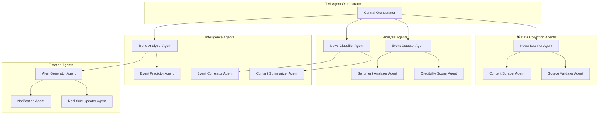

# 🤖 SERVICIOS DE IA Y AGENTES AGÉNTICOS

## 📋 **ÍNDICE**

1. [Arquitectura de IA Agéntica](#arquitectura-ia)
2. [Agentes Autónomos](#agentes-autonomos)
3. [Procesamiento de Lenguaje Natural](#procesamiento-nlp)
4. [Algoritmos de Clustering](#algoritmos-clustering)
5. [Integración con APIs de IA](#integracion-apis)
6. [Prompt Engineering](#prompt-engineering)
7. [Machine Learning Pipeline](#ml-pipeline)
8. [Monitoreo y Optimización](#monitoreo)

---

## 🧠 **ARQUITECTURA DE IA AGÉNTICA**

### **Filosofía del Sistema Multi-Agente**

El sistema utiliza una arquitectura de **múltiples agentes especializados** que trabajan colaborativamente para procesar, analizar y organizar información de noticias de manera inteligente.



### **Principios de Diseño Agéntico**

#### **🎯 Autonomía**
- Cada agente opera independientemente
- Toma decisiones basadas en su conocimiento especializado
- Puede adaptarse a cambios en el entorno

#### **🤝 Colaboración**
- Los agentes se comunican mediante mensajes estructurados
- Comparten conocimiento y resultados
- Coordinan acciones para objetivos comunes

#### **🧠 Inteligencia Distribuida**
- Cada agente tiene un área de expertise
- La inteligencia emerge de la colaboración
- Sistema resistente a fallos individuales

#### **📈 Aprendizaje Continuo**
- Feedback loops para mejorar performance
- Adaptación a nuevos tipos de contenido
- Optimización automática de parámetros

---

## 🕷️ **AGENTES AUTÓNOMOS**

### **🔍 News Scanner Agent**

El agente principal encargado de buscar y recopilar noticias de múltiples fuentes.

```csharp
public class NewsScannerAgent : IAutonomousAgent
{
    private readonly INewsSourceService _sourceService;
    private readonly IContentProcessor _contentProcessor;
    private readonly IAgentCommunication _communication;
    private readonly IAIOrchestrator _orchestrator;
    private readonly ILogger<NewsScannerAgent> _logger;
    
    // Estado interno del agente
    private AgentState _state = new();
    private Dictionary<int, SourceMetrics> _sourceMetrics = new();
    
    public async Task<AgentResult> ExecuteCycle(CancellationToken cancellationToken)
    {
        _logger.LogInformation("🕷️ Scanner Agent iniciando ciclo de escaneo...");
        
        var result = new AgentResult { AgentName = "NewsScannerAgent" };
        
        try
        {
            // 1. Planificación inteligente
            var scanPlan = await CreateIntelligentScanPlan();
            result.AddStep("Planning", $"Creado plan para {scanPlan.Sources.Count} fuentes");
            
            // 2. Ejecución paralela
            var scanResults = await ExecuteParallelScan(scanPlan, cancellationToken);
            result.AddStep("Scanning", $"Escaneadas {scanResults.TotalArticles} noticias");
            
            // 3. Procesamiento preliminar
            var processedNews = await ProcessRawNews(scanResults.RawNews);
            result.AddStep("Processing", $"Procesadas {processedNews.Count} noticias válidas");
            
            // 4. Comunicación con otros agentes
            await NotifyDownstreamAgents(processedNews);
            result.AddStep("Communication", "Notificados agentes downstream");
            
            // 5. Actualización de métricas y aprendizaje
            await UpdateSourceMetrics(scanResults);
            await OptimizeScanningParameters();
            result.AddStep("Learning", "Actualizadas métricas y parámetros");
            
            result.IsSuccess = true;
            result.Data = processedNews;
            
        }
        catch (Exception ex)
        {
            _logger.LogError(ex, "Error en Scanner Agent");
            result.IsSuccess = false;
            result.ErrorMessage = ex.Message;
        }
        
        return result;
    }
    
    private async Task<ScanPlan> CreateIntelligentScanPlan()
    {
        var activeSources = await _sourceService.GetActiveSources();
        var plan = new ScanPlan();
        
        foreach (var source in activeSources)
        {
            // Análisis inteligente de prioridad
            var priority = CalculateSourcePriority(source);
            var estimatedArticles = PredictArticleCount(source);
            
            plan.Sources.Add(new SourceScanTask
            {
                Source = source,
                Priority = priority,
                EstimatedArticles = estimatedArticles,
                ScanStrategy = DetermineScanStrategy(source)
            });
        }
        
        // Ordenar por prioridad y disponibilidad de recursos
        plan.Sources = plan.Sources
            .OrderByDescending(s => s.Priority)
            .ThenBy(s => s.EstimatedLatency)
            .ToList();
        
        return plan;
    }
    
    private async Task<ScanResults> ExecuteParallelScan(ScanPlan plan, CancellationToken cancellationToken)
    {
        var semaphore = new SemaphoreSlim(5, 5); // Max 5 fuentes simultáneas
        var results = new ScanResults();
        
        var tasks = plan.Sources.Select(async sourceTask =>
        {
            await semaphore.WaitAsync(cancellationToken);
            try
            {
                return await ScanSingleSource(sourceTask);
            }
            finally
            {
                semaphore.Release();
            }
        });
        
        var sourceResults = await Task.WhenAll(tasks);
        
        foreach (var sourceResult in sourceResults)
        {
            results.RawNews.AddRange(sourceResult.Articles);
            results.TotalArticles += sourceResult.ArticleCount;
            results.SourceResults.Add(sourceResult);
        }
        
        return results;
    }
    
    private async Task<SourceScanResult> ScanSingleSource(SourceScanTask task)
    {
        var stopwatch = Stopwatch.StartNew();
        var result = new SourceScanResult { Source = task.Source };
        
        try
        {
            switch (task.ScanStrategy)
            {
                case ScanStrategy.RSS:
                    result.Articles = await ScanRSSFeed(task.Source);
                    break;
                case ScanStrategy.API:
                    result.Articles = await ScanAPIEndpoint(task.Source);
                    break;
                case ScanStrategy.WebScraping:
                    result.Articles = await ScanWebPage(task.Source);
                    break;
            }
            
            result.IsSuccess = true;
            result.ArticleCount = result.Articles.Count;
            
            // Actualizar métricas de la fuente
            UpdateSourceMetrics(task.Source.Id, stopwatch.Elapsed, result.ArticleCount);
            
        }
        catch (Exception ex)
        {
            result.IsSuccess = false;
            result.ErrorMessage = ex.Message;
            _logger.LogWarning("Error escaneando fuente {Source}: {Error}", task.Source.Name, ex.Message);
        }
        
        result.ScanDuration = stopwatch.Elapsed;
        return result;
    }
    
    private async Task<List<RawNewsItem>> ScanRSSFeed(NewsSource source)
    {
        var feed = await FeedReader.ReadAsync(source.Url);
        var items = new List<RawNewsItem>();
        
        foreach (var item in feed.Items.Take(source.Configuration.MaxArticlesPerScan))
        {
            var rawItem = new RawNewsItem
            {
                Title = CleanText(item.Title),
                Content = CleanText(item.Description ?? item.Summary),
                Url = item.Link,
                PublishedAt = item.PublishingDate ?? DateTime.UtcNow,
                Source = source.Name,
                SourceId = source.Id,
                Language = DetectLanguage(item.Title + " " + item.Description),
                RawMetadata = ExtractMetadata(item)
            };
            
            // Filtrado preliminar
            if (IsValidNewsItem(rawItem))
            {
                items.Add(rawItem);
            }
        }
        
        return items;
    }
    
    // Comunicación inter-agente
    public async Task ReceiveMessage(AgentMessage message)
    {
        switch (message.Type)
        {
            case AgentMessageType.NewSectionCreated:
                var section = message.GetData<NewsSection>();
                await AddSourcesForSection(section);
                break;
                
            case AgentMessageType.SourceQualityUpdate:
                var qualityUpdate = message.GetData<SourceQualityUpdate>();
                await UpdateSourceCredibility(qualityUpdate);
                break;
                
            case AgentMessageType.ScanFrequencyAdjustment:
                var adjustment = message.GetData<ScanFrequencyAdjustment>();
                await AdjustScanFrequency(adjustment);
                break;
        }
    }
}

// DTOs para el Scanner Agent
public class ScanPlan
{
    public List<SourceScanTask> Sources { get; set; } = new();
    public DateTime CreatedAt { get; set; } = DateTime.UtcNow;
    public TimeSpan EstimatedDuration { get; set; }
}

public class SourceScanTask
{
    public NewsSource Source { get; set; } = null!;
    public decimal Priority { get; set; } // 0-100
    public int EstimatedArticles { get; set; }
    public TimeSpan EstimatedLatency { get; set; }
    public ScanStrategy ScanStrategy { get; set; }
}

public enum ScanStrategy
{
    RSS = 1,
    API = 2,
    WebScraping = 3,
    SocialMedia = 4
}
```

### **🧠 Event Detector Agent**

Agente especializado en detectar eventos principales a partir de clusters de noticias.

```csharp
public class EventDetectorAgent : IAutonomousAgent
{
    private readonly IClusteringService _clustering;
    private readonly IAIService _aiService;
    private readonly IEventRepository _eventRepository;
    private readonly ILogger<EventDetectorAgent> _logger;
    
    public async Task<AgentResult> ExecuteCycle(CancellationToken cancellationToken)
    {
        _logger.LogInformation("🧠 Event Detector Agent iniciando análisis...");
        
        var result = new AgentResult { AgentName = "EventDetectorAgent" };
        
        try
        {
            // 1. Obtener noticias recientes sin asignar
            var unassignedNews = await GetUnassignedNews();
            result.AddStep("DataCollection", $"Obtenidas {unassignedNews.Count} noticias sin asignar");
            
            if (unassignedNews.Count < 3) // Mínimo para clustering
            {
                result.IsSuccess = true;
                result.AddStep("EarlyExit", "Insuficientes noticias para clustering");
                return result;
            }
            
            // 2. Preprocesamiento de texto
            var processedTexts = await PreprocessTexts(unassignedNews);
            result.AddStep("Preprocessing", "Textos preprocesados para análisis");
            
            // 3. Análisis de clustering con múltiples algoritmos
            var clusters = await PerformMultiAlgorithmClustering(processedTexts);
            result.AddStep("Clustering", $"Detectados {clusters.Count} clusters potenciales");
            
            // 4. Validación con IA de eventos significativos
            var validatedEvents = await ValidateEventsWithAI(clusters, unassignedNews);
            result.AddStep("AIValidation", $"Validados {validatedEvents.Count} eventos significativos");
            
            // 5. Creación de jerarquías estrella-planeta-luna
            var hierarchicalEvents = await CreateEventHierarchies(validatedEvents);
            result.AddStep("Hierarchy", "Creadas jerarquías de eventos");
            
            // 6. Cálculo de métricas de impacto
            await CalculateImpactMetrics(hierarchicalEvents);
            result.AddStep("Impact", "Calculadas métricas de impacto");
            
            // 7. Persistencia y notificación
            await SaveEventsAndNotify(hierarchicalEvents);
            result.AddStep("Persistence", "Eventos guardados y notificaciones enviadas");
            
            result.IsSuccess = true;
            result.Data = hierarchicalEvents;
            
        }
        catch (Exception ex)
        {
            _logger.LogError(ex, "Error en Event Detector Agent");
            result.IsSuccess = false;
            result.ErrorMessage = ex.Message;
        }
        
        return result;
    }
    
    private async Task<List<NewsCluster>> PerformMultiAlgorithmClustering(List<ProcessedText> texts)
    {
        var allClusters = new List<NewsCluster>();
        
        // Algoritmo 1: DBSCAN para eventos densos
        var dbscanClusters = await _clustering.DBSCAN(texts, new DBSCANParams
        {
            Epsilon = 0.3,
            MinPoints = 3,
            SimilarityFunction = SimilarityFunction.TF_IDF
        });
        allClusters.AddRange(dbscanClusters.Where(c => c.IsSignificant));
        
        // Algoritmo 2: K-Means para categorías principales
        var optimalK = DetermineOptimalK(texts.Count);
        var kmeansClusters = await _clustering.KMeans(texts, new KMeansParams
        {
            K = optimalK,
            MaxIterations = 100,
            SimilarityFunction = SimilarityFunction.Word2Vec
        });
        allClusters.AddRange(kmeansClusters.Where(c => c.Cohesion > 0.7));
        
        // Algoritmo 3: Hierarchical Clustering para eventos relacionados
        var hierarchicalClusters = await _clustering.Hierarchical(texts, new HierarchicalParams
        {
            Linkage = LinkageType.Average,
            Threshold = 0.6,
            SimilarityFunction = SimilarityFunction.Semantic
        });
        allClusters.AddRange(hierarchicalClusters.Where(c => c.Size >= 3));
        
        // Merge y deduplicación de clusters
        var mergedClusters = await MergeOverlappingClusters(allClusters);
        
        return mergedClusters;
    }
    
    private async Task<List<DetectedEvent>> ValidateEventsWithAI(List<NewsCluster> clusters, List<RawNewsItem> originalNews)
    {
        var validatedEvents = new List<DetectedEvent>();
        
        foreach (var cluster in clusters)
        {
            var clusterNews = GetNewsForCluster(cluster, originalNews);
            
            var validationPrompt = BuildEventValidationPrompt(clusterNews);
            var validationResponse = await _aiService.ProcessPrompt(validationPrompt, new AIConfig
            {
                Model = "claude-sonnet-4",
                MaxTokens = 1000,
                Temperature = 0.3
            });
            
            var validation = ParseValidationResponse(validationResponse);
            
            if (validation.IsSignificantEvent && validation.Confidence >= 0.75)
            {
                var detectedEvent = new DetectedEvent
                {
                    Title = validation.EventTitle,
                    Description = validation.EventDescription,
                    Category = ParseCategory(validation.Category),
                    Priority = ParsePriority(validation.Priority),
                    ImpactScore = validation.ImpactScore,
                    Confidence = validation.Confidence,
                    RelatedArticles = clusterNews,
                    DetectionAlgorithm = cluster.Algorithm,
                    Keywords = ExtractKeywords(clusterNews),
                    Location = ExtractLocation(clusterNews),
                    Metadata = new Dictionary<string, object>
                    {
                        ["cluster_id"] = cluster.Id,
                        ["cluster_size"] = cluster.Size,
                        ["cluster_cohesion"] = cluster.Cohesion,
                        ["ai_confidence"] = validation.Confidence
                    }
                };
                
                validatedEvents.Add(detectedEvent);
            }
        }
        
        return validatedEvents;
    }
    
    private string BuildEventValidationPrompt(List<RawNewsItem> clusterNews)
    {
        var prompt = $@"
# ANÁLISIS DE EVENTO POTENCIAL

Analiza las siguientes {clusterNews.Count} noticias relacionadas y determina si constituyen un evento significativo:

## NOTICIAS A ANALIZAR:
{string.Join("\n", clusterNews.Select((n, i) => $"{i+1}. **{n.Title}** ({n.Source}, {n.PublishedAt:HH:mm})\n   {n.Content?.Substring(0, Math.Min(200, n.Content.Length ?? 0))}..."))}

## CRITERIOS PARA EVENTO SIGNIFICATIVO:
1. ¿Las noticias hablan del mismo evento principal? 
2. ¿Hay suficiente impacto (local, nacional, internacional)?
3. ¿Genera desarrollo continuo y noticias secundarias?
4. ¿Tiene relevancia para múltiples audiencias?

## CATEGORÍAS VÁLIDAS:
- NBQ (Nuclear, Biológico, Químico)
- Politics (Política)
- Economics (Economía) 
- Technology (Tecnología)
- Sports (Deportes)
- Entertainment (Entretenimiento)
- Health (Salud)
- Environment (Medio Ambiente)
- International (Internacional)
- General

## PRIORIDADES:
- Critical: Impacto inmediato masivo, alertas necesarias
- High: Impacto significativo, seguimiento cercano
- Medium: Desarrollo moderado, monitoreo estándar
- Low: Interés limitado, seguimiento básico

## RESPUESTA REQUERIDA (JSON):
{{
  ""is_significant_event"": true/false,
  ""confidence"": 0.85,
  ""event_title"": ""Título conciso del evento"",
  ""event_description"": ""Descripción clara en 1-2 frases"",
  ""category"": ""Category"",
  ""priority"": ""Priority"",
  ""impact_score"": 75,
  ""reasoning"": ""Explicación de por qué es/no es significativo"",
  ""main_keywords"": [""keyword1"", ""keyword2""],
  ""location"": {{
    ""country"": ""España"",
    ""region"": ""Madrid"",
    ""city"": ""Madrid""
  }},
  ""expected_developments"": [""desarrollo1"", ""desarrollo2""]
}}
        ";
        
        return prompt;
    }
    
    private async Task<List<HierarchicalEvent>> CreateEventHierarchies(List<DetectedEvent> events)
    {
        var hierarchicalEvents = new List<HierarchicalEvent>();
        
        foreach (var detectedEvent in events)
        {
            var hierarchyPrompt = BuildHierarchyPrompt(detectedEvent);
            var hierarchyResponse = await _aiService.ProcessPrompt(hierarchyPrompt);
            var hierarchy = ParseHierarchyResponse(hierarchyResponse);
            
            var hierarchicalEvent = new HierarchicalEvent
            {
                Event = detectedEvent,
                MainPlanets = hierarchy.MainPlanets,
                SecondaryPlanets = hierarchy.SecondaryPlanets,
                Moons = hierarchy.Moons
            };
            
            hierarchicalEvents.Add(hierarchicalEvent);
        }
        
        return hierarchicalEvents;
    }
    
    private string BuildHierarchyPrompt(DetectedEvent detectedEvent)
    {
        return $@"
# CREACIÓN DE JERARQUÍA PARA EVENTO: {detectedEvent.Title}

Organiza las siguientes noticias en una jerarquía tipo sistema solar:

**ESTRELLA CENTRAL**: {detectedEvent.Title}

## NOTICIAS A CLASIFICAR:
{string.Join("\n", detectedEvent.RelatedArticles.Select((a, i) => $"{i+1}. {a.Title} ({a.Source})"))}

## JERARQUÍA REQUERIDA:
- **PLANETA PRINCIPAL**: La noticia más importante/original del evento
- **PLANETAS SECUNDARIOS**: Desarrollos importantes que merecen atención
- **LUNAS**: Noticias menores que complementan/orbitan los planetas

## CRITERIOS:
- Priorizar por importancia, novedad y impacto
- Máximo 1 planeta principal, 3-4 planetas secundarios
- Las lunas deben estar relacionadas específicamente con su planeta padre

## RESPUESTA JSON:
{{
  ""main_planet"": {{
    ""article_id"": 1,
    ""justification"": ""Por qué es el planeta principal""
  }},
  ""secondary_planets"": [
    {{
      ""article_id"": 2,
      ""importance"": 85,
      ""justification"": ""Razón""
    }}
  ],
  ""moons"": [
    {{
      ""article_id"": 5,
      ""parent_planet_id"": 2,
      ""orbit_type"": ""analysis"",
      ""justification"": ""Por qué es luna de este planeta""
    }}
  ]
}}
        ";
    }
}
```

### **📊 News Classifier Agent**

Agente encargado de clasificar noticias por categoría, sentimiento y credibilidad.

```csharp
public class NewsClassifierAgent : IAutonomousAgent
{
    private readonly ISentimentAnalysisService _sentimentService;
    private readonly ICredibilityService _credibilityService;
    private readonly ICategoryPredictionService _categoryService;
    private readonly IAIService _aiService;
    
    public async Task<AgentResult> ExecuteCycle(CancellationToken cancellationToken)
    {
        _logger.LogInformation("📊 News Classifier Agent iniciando clasificación...");
        
        var result = new AgentResult { AgentName = "NewsClassifierAgent" };
        
        try
        {
            // 1. Obtener noticias pendientes de clasificación
            var pendingArticles = await GetPendingClassificationArticles();
            result.AddStep("DataCollection", $"Obtenidas {pendingArticles.Count} noticias para clasificar");
            
            // 2. Clasificación paralela por tipo de análisis
            var classificationTasks = new List<Task<ClassificationBatch>>
            {
                ClassifySentiments(pendingArticles),
                ClassifyCredibility(pendingArticles), 
                ClassifyCategories(pendingArticles),
                ExtractKeywords(pendingArticles),
                DetectLanguages(pendingArticles)
            };
            
            var classificationResults = await Task.WhenAll(classificationTasks);
            result.AddStep("Classification", "Completada clasificación paralela");
            
            // 3. Consolidación de resultados
            var consolidatedResults = ConsolidateClassifications(classificationResults);
            result.AddStep("Consolidation", "Consolidados resultados de clasificación");
            
            // 4. Análisis de calidad y validación
            var qualityAnalysis = await AnalyzeClassificationQuality(consolidatedResults);
            result.AddStep("Quality", $"Calidad promedio: {qualityAnalysis.AverageConfidence:P}");
            
            // 5. Aplicación de reglas de negocio
            await ApplyBusinessRules(consolidatedResults);
            result.AddStep("BusinessRules", "Aplicadas reglas de negocio");
            
            // 6. Persistencia y notificación
            await SaveClassificationsAndNotify(consolidatedResults);
            result.AddStep("Persistence", "Clasificaciones guardadas");
            
            result.IsSuccess = true;
            result.Data = consolidatedResults;
            
        }
        catch (Exception ex)
        {
            _logger.LogError(ex, "Error en News Classifier Agent");
            result.IsSuccess = false;
            result.ErrorMessage = ex.Message;
        }
        
        return result;
    }
    
    private async Task<ClassificationBatch> ClassifySentiments(List<NewsArticle> articles)
    {
        var batch = new ClassificationBatch { Type = ClassificationType.Sentiment };
        
        foreach (var article in articles)
        {
            try
            {
                // Análisis multi-modelo para mayor precisión
                var localSentiment = await _sentimentService.AnalyzeLocal(article.Content);
                var aiSentiment = await AnalyzeSentimentWithAI(article);
                
                // Combinar resultados con pesos
                var combinedSentiment = CombineSentimentResults(localSentiment, aiSentiment);
                
                batch.Results.Add(new ClassificationResult
                {
                    ArticleId = article.Id,
                    Classification = combinedSentiment,
                    Confidence = CalculateConfidence(localSentiment, aiSentiment),
                    Metadata = new Dictionary<string, object>
                    {
                        ["local_sentiment"] = localSentiment,
                        ["ai_sentiment"] = aiSentiment,
                        ["processing_time"] = stopwatch.ElapsedMilliseconds
                    }
                });
            }
            catch (Exception ex)
            {
                _logger.LogWarning("Error clasificando sentimiento para artículo {ArticleId}: {Error}", 
                    article.Id, ex.Message);
                
                batch.Results.Add(new ClassificationResult
                {
                    ArticleId = article.Id,
                    Classification = GetDefaultSentiment(),
                    Confidence = 0.1m,
                    Error = ex.Message
                });
            }
        }
        
        return batch;
    }
    
    private async Task<SentimentAnalysis> AnalyzeSentimentWithAI(NewsArticle article)
    {
        var prompt = $@"
# ANÁLISIS DE SENTIMIENTO AVANZADO

Analiza el sentimiento de la siguiente noticia considerando:
- Tono general del texto
- Emociones expresadas
- Impacto potencial en el lector
- Contexto cultural y político

## NOTICIA:
**Título**: {article.Title}
**Contenido**: {article.Content}
**Fuente**: {article.Source}

## CATEGORÍAS DE SENTIMIENTO:
- **Positivo**: Optimista, esperanzador, celebratorio
- **Negativo**: Pesimista, preocupante, conflictivo  
- **Neutral**: Informativo, objetivo, equilibrado
- **Mixto**: Elementos tanto positivos como negativos

## INTENSIDAD (1-100):
- 1-20: Muy suave
- 21-40: Suave
- 41-60: Moderado
- 61-80: Fuerte
- 81-100: Muy fuerte

## RESPUESTA JSON:
{{
  ""primary_sentiment"": ""Negative"",
  ""positive_score"": 15,
  ""negative_score"": 75,
  ""neutral_score"": 10,
  ""intensity"": 70,
  ""confidence"": 0.85,
  ""emotional_tags"": [""preocupación"", ""urgencia"", ""alarma""],
  ""reasoning"": ""Explicación del análisis""
}}
        ";
        
        var response = await _aiService.ProcessPrompt(prompt);
        return ParseSentimentResponse(response);
    }
    
    private async Task<ClassificationBatch> ClassifyCredibility(List<NewsArticle> articles)
    {
        var batch = new ClassificationBatch { Type = ClassificationType.Credibility };
        
        foreach (var article in articles)
        {
            var credibilityFactors = await AnalyzeCredibilityFactors(article);
            var aiCredibility = await AnalyzeCredibilityWithAI(article, credibilityFactors);
            
            var finalScore = CalculateFinalCredibilityScore(credibilityFactors, aiCredibility);
            
            batch.Results.Add(new ClassificationResult
            {
                ArticleId = article.Id,
                Classification = new CredibilityClassification
                {
                    Score = finalScore.Score,
                    Level = DetermineCredibilityLevel(finalScore.Score),
                    Factors = credibilityFactors,
                    AIAnalysis = aiCredibility
                },
                Confidence = finalScore.Confidence
            });
        }
        
        return batch;
    }
    
    private async Task<CredibilityFactors> AnalyzeCredibilityFactors(NewsArticle article)
    {
        var factors = new CredibilityFactors();
        
        // Factor 1: Reputación de la fuente
        factors.SourceReputation = await GetSourceReputation(article.Source);
        
        // Factor 2: Calidad del contenido
        factors.ContentQuality = AnalyzeContentQuality(article.Content);
        
        // Factor 3: Verificación de hechos
        factors.FactualAccuracy = await VerifyFacts(article.Content);
        
        // Factor 4: Consistencia temporal
        factors.TemporalConsistency = AnalyzeTemporalConsistency(article);
        
        // Factor 5: Corroboración con otras fuentes
        factors.SourceCorroboration = await CheckSourceCorroboration(article);
        
        // Factor 6: Análisis de lenguaje
        factors.LanguageAnalysis = AnalyzeLanguagePatterns(article.Content);
        
        return factors;
    }
    
    private async Task<AICredibilityAnalysis> AnalyzeCredibilityWithAI(NewsArticle article, CredibilityFactors factors)
    {
        var prompt = $@"
# ANÁLISIS DE CREDIBILIDAD PERIODÍSTICA

Evalúa la credibilidad de esta noticia considerando múltiples factores:

## NOTICIA:
**Título**: {article.Title}
**Contenido**: {article.Content.Substring(0, Math.Min(1000, article.Content.Length))}...
**Fuente**: {article.Source}
**Fecha**: {article.PublishedAt}

## FACTORES TÉCNICOS YA ANALIZADOS:
- Reputación fuente: {factors.SourceReputation}/100
- Calidad contenido: {factors.ContentQuality}/100  
- Verificación hechos: {factors.FactualAccuracy}/100
- Consistencia temporal: {factors.TemporalConsistency}/100
- Corroboración fuentes: {factors.SourceCorroboration}/100

## EVALÚA TAMBIÉN:
1. **Objetividad**: ¿Presenta hechos o opiniones?
2. **Transparencia**: ¿Cita fuentes verificables?
3. **Equilibrio**: ¿Muestra múltiples perspectivas?
4. **Precisión**: ¿Los datos son específicos y verificables?
5. **Sesgo**: ¿Detectas inclinación política/ideológica?

## SEÑALES DE ALERTA:
- Lenguaje excesivamente emotivo
- Afirmaciones sin respaldo
- Títulos sensacionalistas  
- Falta de contexto
- Fuentes anónimas sin justificación

## RESPUESTA JSON:
{{
  ""credibility_score"": 75,
  ""confidence"": 0.88,
  ""objectivity_score"": 80,
  ""transparency_score"": 70,
  ""balance_score"": 85,
  ""precision_score"": 75,
  ""bias_detected"": false,
  ""bias_type"": null,
  ""warning_flags"": [],
  ""positive_indicators"": [""cita fuentes oficiales"", ""datos específicos""],
  ""improvement_suggestions"": [""más contexto histórico""],
  ""reasoning"": ""Análisis detallado""
}}
        ";
        
        var response = await _aiService.ProcessPrompt(prompt);
        return ParseCredibilityResponse(response);
    }
    
    private async Task<ClassificationBatch> ClassifyCategories(List<NewsArticle> articles)
    {
        var batch = new ClassificationBatch { Type = ClassificationType.Category };
        
        // Preparar textos para clasificación masiva
        var texts = articles.Select(a => $"{a.Title} {a.Content}").ToList();
        
        // Clasificación local con ML model
        var localPredictions = await _categoryService.PredictBatch(texts);
        
        // Clasificación con IA para casos complejos
        var complexCases = articles.Where((a, i) => localPredictions[i].Confidence < 0.8).ToList();
        var aiPredictions = await ClassifyComplexCasesWithAI(complexCases);
        
        // Combinar resultados
        for (int i = 0; i < articles.Count; i++)
        {
            var article = articles[i];
            var localPred = localPredictions[i];
            var aiPred = aiPredictions?.FirstOrDefault(ap => ap.ArticleId == article.Id);
            
            var finalClassification = CombineCategoryPredictions(localPred, aiPred);
            
            batch.Results.Add(new ClassificationResult
            {
                ArticleId = article.Id,
                Classification = finalClassification,
                Confidence = finalClassification.Confidence
            });
        }
        
        return batch;
    }
}
```

### **🔮 Trend Analyzer Agent**

Agente especializado en análisis de tendencias y predicciones.

```csharp
public class TrendAnalyzerAgent : IAutonomousAgent
{
    public async Task<AgentResult> ExecuteCycle(CancellationToken cancellationToken)
    {
        _logger.LogInformation("🔮 Trend Analyzer Agent iniciando análisis...");
        
        var result = new AgentResult { AgentName = "TrendAnalyzerAgent" };
        
        try
        {
            // 1. Recopilación de datos históricos
            var historicalData = await GatherHistoricalData();
            result.AddStep("DataGathering", $"Recopilados datos de {historicalData.TimeRange} días");
            
            // 2. Análisis de patrones temporales
            var temporalPatterns = await AnalyzeTemporalPatterns(historicalData);
            result.AddStep("TemporalAnalysis", $"Detectados {temporalPatterns.Count} patrones");
            
            // 3. Detección de tendencias emergentes
            var emergingTrends = await DetectEmergingTrends(historicalData);
            result.AddStep("TrendDetection", $"Identificadas {emergingTrends.Count} tendencias emergentes");
            
            // 4. Análisis de anomalías
            var anomalies = await DetectAnomalies(historicalData);
            result.AddStep("AnomalyDetection", $"Detectadas {anomalies.Count} anomalías");
            
            // 5. Predicciones a corto y medio plazo
            var predictions = await GeneratePredictions(historicalData, temporalPatterns);
            result.AddStep("Predictions", $"Generadas predicciones para {predictions.TimeHorizon}");
            
            // 6. Análisis de correlaciones entre eventos
            var correlations = await AnalyzeEventCorrelations(historicalData);
            result.AddStep("Correlations", $"Analizadas {correlations.Count} correlaciones");
            
            // 7. Generación de alertas de tendencia
            var trendAlerts = await GenerateTrendAlerts(emergingTrends, anomalies);
            result.AddStep("Alerts", $"Generadas {trendAlerts.Count} alertas de tendencia");
            
            result.IsSuccess = true;
            result.Data = new TrendAnalysisResults
            {
                TemporalPatterns = temporalPatterns,
                EmergingTrends = emergingTrends,
                Anomalies = anomalies,
                Predictions = predictions,
                Correlations = correlations,
                TrendAlerts = trendAlerts
            };
            
        }
        catch (Exception ex)
        {
            _logger.LogError(ex, "Error en Trend Analyzer Agent");
            result.IsSuccess = false;
            result.ErrorMessage = ex.Message;
        }
        
        return result;
    }
    
    private async Task<List<EmergingTrend>> DetectEmergingTrends(HistoricalData data)
    {
        var trends = new List<EmergingTrend>();
        
        // Análisis de velocidad de keyword appearance
        var keywordVelocity = AnalyzeKeywordVelocity(data);
        
        // Análisis de crecimiento de eventos por categoría
        var categoryGrowth = AnalyzeCategoryGrowth(data);
        
        // Análisis de patrones de fuente
        var sourcePatterns = AnalyzeSourcePatterns(data);
        
        // IA para detectar tendencias sutiles
        var aiTrends = await DetectTrendsWithAI(data);
        
        // Combinar y validar todas las fuentes
        trends.AddRange(ValidateAndMergeTrends(keywordVelocity, categoryGrowth, sourcePatterns, aiTrends));
        
        return trends;
    }
    
    private async Task<TrendPredictions> GeneratePredictions(HistoricalData data, List<TemporalPattern> patterns)
    {
        var predictions = new TrendPredictions();
        
        // Predicciones a 24 horas
        predictions.ShortTerm = await GenerateShortTermPredictions(data, patterns);
        
        // Predicciones a 7 días
        predictions.MediumTerm = await GenerateMediumTermPredictions(data, patterns);
        
        // Predicciones a 30 días (menos precisas)
        predictions.LongTerm = await GenerateLongTermPredictions(data, patterns);
        
        return predictions;
    }
    
    private async Task<List<ShortTermPrediction>> GenerateShortTermPredictions(HistoricalData data, List<TemporalPattern> patterns)
    {
        var predictions = new List<ShortTermPrediction>();
        
        var aiPrompt = $@"
# PREDICCIÓN DE TENDENCIAS A 24 HORAS

Basándote en los datos históricos y patrones detectados, predice qué eventos/temas tendrán mayor actividad en las próximas 24 horas.

## DATOS HISTÓRICOS (últimos 7 días):
{SerializeHistoricalData(data)}

## PATRONES TEMPORALES DETECTADOS:
{SerializeTemporalPatterns(patterns)}

## FACTORES A CONSIDERAR:
- Ciclos temporales detectados
- Velocidad de crecimiento actual  
- Eventos programados conocidos
- Patrones estacionales
- Momentum actual de temas

## RESPUESTA JSON:
{{
  ""predictions"": [
    {{
      ""topic"": ""Nombre del tema/evento"",
      ""category"": ""Categoría"",
      ""predicted_activity_increase"": 45,
      ""confidence"": 0.75,
      ""peak_time"": ""2026-03-07T14:00:00Z"",
      ""reasoning"": ""Por qué se espera este aumento"",
      ""trigger_events"": [""evento1"", ""evento2""],
      ""keywords_to_watch"": [""keyword1"", ""keyword2""]
    }}
  ]
}}
        ";
        
        var response = await _aiService.ProcessPrompt(aiPrompt);
        var aiPredictions = ParsePredictionResponse(response);
        
        // Combinar con análisis estadístico
        var statisticalPredictions = GenerateStatisticalPredictions(data, TimeSpan.FromHours(24));
        
        predictions.AddRange(MergePredictions(aiPredictions, statisticalPredictions));
        
        return predictions;
    }
}
```

---

## 🔗 **PROCESAMIENTO DE LENGUAJE NATURAL**

### **NLP Pipeline Avanzado**

```csharp
public class AdvancedNLPPipeline
{
    private readonly ITextPreprocessor _preprocessor;
    private readonly INamedEntityRecognizer _nerService;
    private readonly ISemanticAnalyzer _semanticAnalyzer;
    private readonly ILanguageDetector _languageDetector;
    
    public async Task<ProcessedText> ProcessText(string rawText, ProcessingOptions options)
    {
        var result = new ProcessedText { OriginalText = rawText };
        
        // 1. Detección de idioma
        result.Language = await _languageDetector.Detect(rawText);
        
        // 2. Preprocesamiento específico por idioma
        result.CleanedText = await _preprocessor.Clean(rawText, result.Language);
        
        // 3. Tokenización avanzada
        result.Tokens = await TokenizeText(result.CleanedText, result.Language);
        
        // 4. Reconocimiento de entidades nombradas
        result.NamedEntities = await _nerService.Extract(result.CleanedText);
        
        // 5. Análisis semántico y embeddings
        result.SemanticEmbedding = await _semanticAnalyzer.GenerateEmbedding(result.CleanedText);
        
        // 6. Extracción de keywords con TF-IDF y métodos avanzados
        result.Keywords = await ExtractKeywords(result.CleanedText, result.NamedEntities);
        
        // 7. Análisis de estructura del texto
        result.Structure = AnalyzeTextStructure(result.CleanedText);
        
        return result;
    }
    
    private async Task<List<Keyword>> ExtractKeywords(string text, List<NamedEntity> entities)
    {
        var keywords = new List<Keyword>();
        
        // Método 1: TF-IDF clásico
        var tfidfKeywords = await ExtractTFIDFKeywords(text);
        keywords.AddRange(tfidfKeywords);
        
        // Método 2: Entidades nombradas como keywords importantes
        var entityKeywords = entities.Select(e => new Keyword
        {
            Text = e.Text,
            Score = e.Confidence,
            Type = KeywordType.NamedEntity,
            EntityType = e.Type
        });
        keywords.AddRange(entityKeywords);
        
        // Método 3: Análisis de n-gramas importantes
        var ngramKeywords = ExtractNGramKeywords(text);
        keywords.AddRange(ngramKeywords);
        
        // Método 4: Keywords específicos del dominio (NBQ, política, etc.)
        var domainKeywords = await ExtractDomainSpecificKeywords(text);
        keywords.AddRange(domainKeywords);
        
        // Deduplicar y rankear
        var rankedKeywords = RankAndDeduplicateKeywords(keywords);
        
        return rankedKeywords.Take(20).ToList(); // Top 20 keywords
    }
    
    private async Task<List<Keyword>> ExtractDomainSpecificKeywords(string text)
    {
        var domainKeywords = new List<Keyword>();
        
        // Diccionarios específicos de dominio
        var nbqTerms = await GetNBQTermsDictionary();
        var politicsTerms = await GetPoliticsTermsDictionary();
        var techTerms = await GetTechTermsDictionary();
        
        // Buscar términos NBQ (alta prioridad)
        foreach (var term in nbqTerms)
        {
            if (text.ContainsIgnoreCase(term.Text))
            {
                domainKeywords.Add(new Keyword
                {
                    Text = term.Text,
                    Score = term.Importance * 1.5m, // Boost NBQ terms
                    Type = KeywordType.Domain,
                    Domain = "NBQ"
                });
            }
        }
        
        // Continuar con otros dominios...
        
        return domainKeywords;
    }
}

public class ProcessedText
{
    public string OriginalText { get; set; } = string.Empty;
    public string CleanedText { get; set; } = string.Empty;
    public string Language { get; set; } = "es";
    public List<Token> Tokens { get; set; } = new();
    public List<NamedEntity> NamedEntities { get; set; } = new();
    public float[] SemanticEmbedding { get; set; } = Array.Empty<float>();
    public List<Keyword> Keywords { get; set; } = new();
    public TextStructure Structure { get; set; } = new();
    public Dictionary<string, object> Metadata { get; set; } = new();
}

public class NamedEntity
{
    public string Text { get; set; } = string.Empty;
    public string Type { get; set; } = string.Empty; // PERSON, ORG, LOC, MISC, DATE, etc.
    public decimal Confidence { get; set; }
    public int StartPosition { get; set; }
    public int EndPosition { get; set; }
    public Dictionary<string, object> Properties { get; set; } = new();
}

public class Keyword
{
    public string Text { get; set; } = string.Empty;
    public decimal Score { get; set; }
    public KeywordType Type { get; set; }
    public string? Domain { get; set; }
    public string? EntityType { get; set; }
    public int Frequency { get; set; }
    public List<int> Positions { get; set; } = new();
}

public enum KeywordType
{
    TFIDF = 1,
    NamedEntity = 2,
    NGram = 3,
    Domain = 4,
    Trending = 5
}
```

---

## 🔄 **ALGORITMOS DE CLUSTERING**

### **Multi-Algorithm Clustering Service**

```csharp
public class AdvancedClusteringService
{
    public async Task<List<NewsCluster>> DBSCAN(List<ProcessedText> texts, DBSCANParams parameters)
    {
        // Preparar matriz de similitudes
        var similarityMatrix = await CalculateSimilarityMatrix(texts, parameters.SimilarityFunction);
        
        var clusters = new List<NewsCluster>();
        var visited = new HashSet<int>();
        var clustered = new HashSet<int>();
        
        for (int i = 0; i < texts.Count; i++)
        {
            if (visited.Contains(i)) continue;
            
            visited.Add(i);
            var neighbors = GetNeighbors(i, similarityMatrix, parameters.Epsilon);
            
            if (neighbors.Count < parameters.MinPoints)
            {
                // Punto de ruido, lo ignoramos por ahora
                continue;
            }
            
            // Crear nuevo cluster
            var cluster = new NewsCluster
            {
                Id = clusters.Count + 1,
                Algorithm = "DBSCAN",
                Points = new List<int> { i }
            };
            
            clustered.Add(i);
            
            // Expandir cluster
            var seedSet = new Queue<int>(neighbors);
            while (seedSet.Any())
            {
                var current = seedSet.Dequeue();
                
                if (!visited.Contains(current))
                {
                    visited.Add(current);
                    var currentNeighbors = GetNeighbors(current, similarityMatrix, parameters.Epsilon);
                    
                    if (currentNeighbors.Count >= parameters.MinPoints)
                    {
                        foreach (var neighbor in currentNeighbors)
                        {
                            seedSet.Enqueue(neighbor);
                        }
                    }
                }
                
                if (!clustered.Contains(current))
                {
                    cluster.Points.Add(current);
                    clustered.Add(current);
                }
            }
            
            // Validar cluster
            if (ValidateCluster(cluster, texts))
            {
                cluster.Centroid = CalculateClusterCentroid(cluster, texts);
                cluster.Cohesion = CalculateClusterCohesion(cluster, texts);
                clusters.Add(cluster);
            }
        }
        
        return clusters;
    }
    
    public async Task<List<NewsCluster>> KMeansWithSmartK(List<ProcessedText> texts, KMeansParams parameters)
    {
        // Determinar K óptimo si no se especifica
        if (parameters.K <= 0)
        {
            parameters.K = DetermineOptimalK(texts);
        }
        
        // Inicialización K-means++
        var centroids = InitializeCentroidsKMeansPlusPlus(texts, parameters.K);
        
        var assignments = new int[texts.Count];
        var clusters = new List<NewsCluster>();
        
        bool converged = false;
        int iteration = 0;
        
        while (!converged && iteration < parameters.MaxIterations)
        {
            var oldAssignments = (int[])assignments.Clone();
            
            // Asignar puntos a clusters más cercanos
            for (int i = 0; i < texts.Count; i++)
            {
                var minDistance = double.MaxValue;
                var nearestCluster = 0;
                
                for (int k = 0; k < parameters.K; k++)
                {
                    var distance = CalculateDistance(texts[i].SemanticEmbedding, centroids[k]);
                    if (distance < minDistance)
                    {
                        minDistance = distance;
                        nearestCluster = k;
                    }
                }
                
                assignments[i] = nearestCluster;
            }
            
            // Recalcular centroides
            for (int k = 0; k < parameters.K; k++)
            {
                var clusterPoints = texts.Where((t, i) => assignments[i] == k).ToList();
                if (clusterPoints.Any())
                {
                    centroids[k] = CalculateAverageEmbedding(clusterPoints);
                }
            }
            
            // Verificar convergencia
            converged = AssignmentsEqual(oldAssignments, assignments);
            iteration++;
        }
        
        // Crear objetos cluster
        for (int k = 0; k < parameters.K; k++)
        {
            var clusterPoints = Enumerable.Range(0, texts.Count)
                .Where(i => assignments[i] == k)
                .ToList();
            
            if (clusterPoints.Count >= 2) // Mínimo 2 puntos por cluster
            {
                var cluster = new NewsCluster
                {
                    Id = k + 1,
                    Algorithm = "K-Means",
                    Points = clusterPoints,
                    Centroid = centroids[k],
                    Cohesion = CalculateClusterCohesion(clusterPoints, texts)
                };
                
                if (ValidateCluster(cluster, texts))
                {
                    clusters.Add(cluster);
                }
            }
        }
        
        return clusters;
    }
    
    private int DetermineOptimalK(List<ProcessedText> texts)
    {
        // Método del codo (Elbow method) simplificado
        var maxK = Math.Min(10, texts.Count / 3);
        var inertias = new List<double>();
        
        for (int k = 2; k <= maxK; k++)
        {
            var tempClusters = KMeans(texts, k, 50);
            var inertia = CalculateInertia(tempClusters, texts);
            inertias.Add(inertia);
        }
        
        // Encontrar el "codo" en la curva de inercia
        var optimalK = FindElbow(inertias) + 2; // +2 porque empezamos en k=2
        
        return Math.Max(2, Math.Min(optimalK, maxK));
    }
    
    private float[] InitializeCentroidsKMeansPlusPlus(List<ProcessedText> texts, int k)
    {
        var centroids = new List<float[]>();
        var random = new Random();
        
        // Primer centroide aleatorio
        centroids.Add(texts[random.Next(texts.Count)].SemanticEmbedding);
        
        // Resto de centroides con K-means++
        while (centroids.Count < k)
        {
            var distances = new double[texts.Count];
            
            for (int i = 0; i < texts.Count; i++)
            {
                var minDist = double.MaxValue;
                foreach (var centroid in centroids)
                {
                    var dist = CalculateDistance(texts[i].SemanticEmbedding, centroid);
                    minDist = Math.Min(minDist, dist);
                }
                distances[i] = minDist * minDist; // Squared distance
            }
            
            // Selección probabilística
            var totalDistance = distances.Sum();
            var randomValue = random.NextDouble() * totalDistance;
            
            double cumulativeDistance = 0;
            for (int i = 0; i < distances.Length; i++)
            {
                cumulativeDistance += distances[i];
                if (cumulativeDistance >= randomValue)
                {
                    centroids.Add(texts[i].SemanticEmbedding);
                    break;
                }
            }
        }
        
        return centroids.ToArray();
    }
    
    public async Task<double[][]> CalculateSimilarityMatrix(List<ProcessedText> texts, SimilarityFunction function)
    {
        var matrix = new double[texts.Count][];
        for (int i = 0; i < texts.Count; i++)
        {
            matrix[i] = new double[texts.Count];
        }
        
        // Cálculo paralelo de similitudes
        await Task.Run(() =>
        {
            Parallel.For(0, texts.Count, i =>
            {
                for (int j = i; j < texts.Count; j++)
                {
                    double similarity = function switch
                    {
                        SimilarityFunction.TF_IDF => CalculateTFIDFSimilarity(texts[i], texts[j]),
                        SimilarityFunction.Word2Vec => CalculateWord2VecSimilarity(texts[i], texts[j]),
                        SimilarityFunction.Semantic => CalculateSemanticSimilarity(texts[i], texts[j]),
                        SimilarityFunction.Jaccard => CalculateJaccardSimilarity(texts[i], texts[j]),
                        _ => CalculateCosineSimilarity(texts[i].SemanticEmbedding, texts[j].SemanticEmbedding)
                    };
                    
                    matrix[i][j] = similarity;
                    matrix[j][i] = similarity; // Matrix is symmetric
                }
            });
        });
        
        return matrix;
    }
}

// Enums y DTOs para clustering
public enum SimilarityFunction
{
    TF_IDF = 1,
    Word2Vec = 2,
    Semantic = 3,
    Jaccard = 4,
    Cosine = 5
}

public class DBSCANParams
{
    public double Epsilon { get; set; } = 0.3;
    public int MinPoints { get; set; } = 3;
    public SimilarityFunction SimilarityFunction { get; set; } = SimilarityFunction.Semantic;
}

public class KMeansParams
{
    public int K { get; set; } = 0; // 0 = auto-determine
    public int MaxIterations { get; set; } = 100;
    public SimilarityFunction SimilarityFunction { get; set; } = SimilarityFunction.Word2Vec;
    public double ConvergenceThreshold { get; set; } = 0.001;
}

public class NewsCluster
{
    public int Id { get; set; }
    public string Algorithm { get; set; } = string.Empty;
    public List<int> Points { get; set; } = new();
    public float[] Centroid { get; set; } = Array.Empty<float>();
    public double Cohesion { get; set; }
    public int Size => Points.Count;
    public bool IsSignificant => Size >= 3 && Cohesion > 0.6;
    public Dictionary<string, object> Metadata { get; set; } = new();
}
```

---

## 🌐 **INTEGRACIÓN CON APIs DE IA**

### **AI Service Orchestrator**

```csharp
public class AIServiceOrchestrator
{
    private readonly Dictionary<string, IAIProvider> _providers;
    private readonly IConfiguration _config;
    private readonly ILogger<AIServiceOrchestrator> _logger;
    
    public AIServiceOrchestrator(IServiceProvider serviceProvider, IConfiguration config)
    {
        _config = config;
        _providers = new Dictionary<string, IAIProvider>
        {
            ["openai"] = serviceProvider.GetRequiredService<OpenAIProvider>(),
            ["claude"] = serviceProvider.GetRequiredService<ClaudeProvider>(),
            ["local"] = serviceProvider.GetRequiredService<LocalLLMProvider>()
        };
    }
    
    public async Task<string> ProcessPrompt(string prompt, AIConfig? config = null)
    {
        config ??= GetDefaultConfig();
        
        // Selección inteligente de proveedor
        var provider = SelectOptimalProvider(prompt, config);
        
        try
        {
            var result = await _providers[provider].ProcessPrompt(prompt, config);
            
            // Log de métricas
            LogUsageMetrics(provider, prompt.Length, result.Length, config);
            
            return result;
        }
        catch (Exception ex) when (IsRateLimitException(ex))
        {
            // Fallback a otro proveedor
            _logger.LogWarning("Rate limit en {Provider}, usando fallback", provider);
            return await ProcessPromptWithFallback(prompt, config, provider);
        }
    }
    
    private string SelectOptimalProvider(string prompt, AIConfig config)
    {
        // Reglas de selección basadas en contexto
        if (config.RequireHighQuality && prompt.Contains("NBQ"))
        {
            return "claude"; // Claude para análisis NBQ críticos
        }
        
        if (prompt.Length > 8000 || config.RequireLongContext)
        {
            return "claude"; // Claude para contextos largos
        }
        
        if (config.RequireFastResponse)
        {
            return "openai"; // OpenAI para respuestas rápidas
        }
        
        // Balanceado por costo y disponibilidad
        return GetLeastBusyProvider();
    }
    
    private async Task<string> ProcessPromptWithFallback(string prompt, AIConfig config, string failedProvider)
    {
        var fallbackOrder = GetFallbackOrder(failedProvider);
        
        foreach (var provider in fallbackOrder)
        {
            try
            {
                return await _providers[provider].ProcessPrompt(prompt, config);
            }
            catch (Exception ex)
            {
                _logger.LogWarning("Fallback {Provider} también falló: {Error}", provider, ex.Message);
            }
        }
        
        // Último recurso: modelo local
        return await _providers["local"].ProcessPrompt(prompt, config);
    }
}

public class OpenAIProvider : IAIProvider
{
    private readonly HttpClient _httpClient;
    private readonly string _apiKey;
    private readonly IRateLimiter _rateLimiter;
    
    public async Task<string> ProcessPrompt(string prompt, AIConfig config)
    {
        await _rateLimiter.WaitForAvailability();
        
        var request = new
        {
            model = config.Model ?? "gpt-4-turbo",
            messages = new[]
            {
                new { role = "system", content = "Eres un asistente especializado en análisis de noticias." },
                new { role = "user", content = prompt }
            },
            max_tokens = config.MaxTokens,
            temperature = config.Temperature
        };
        
        var response = await _httpClient.PostAsync("https://api.openai.com/v1/chat/completions",
            new StringContent(JsonSerializer.Serialize(request), Encoding.UTF8, "application/json"));
        
        response.EnsureSuccessStatusCode();
        
        var responseJson = await response.Content.ReadAsStringAsync();
        var result = JsonSerializer.Deserialize<OpenAIResponse>(responseJson);
        
        return result.Choices[0].Message.Content;
    }
}

public class ClaudeProvider : IAIProvider
{
    private readonly HttpClient _httpClient;
    private readonly string _apiKey;
    
    public async Task<string> ProcessPrompt(string prompt, AIConfig config)
    {
        var request = new
        {
            model = config.Model ?? "claude-sonnet-4-20250514",
            max_tokens = config.MaxTokens,
            messages = new[]
            {
                new { role = "user", content = prompt }
            }
        };
        
        _httpClient.DefaultRequestHeaders.Clear();
        _httpClient.DefaultRequestHeaders.Add("x-api-key", _apiKey);
        _httpClient.DefaultRequestHeaders.Add("anthropic-version", "2023-06-01");
        
        var response = await _httpClient.PostAsync("https://api.anthropic.com/v1/messages",
            new StringContent(JsonSerializer.Serialize(request), Encoding.UTF8, "application/json"));
        
        response.EnsureSuccessStatusCode();
        
        var responseJson = await response.Content.ReadAsStringAsync();
        var result = JsonSerializer.Deserialize<ClaudeResponse>(responseJson);
        
        return result.Content[0].Text;
    }
}

public class LocalLLMProvider : IAIProvider
{
    // Implementación con Ollama o similar para fallback offline
    public async Task<string> ProcessPrompt(string prompt, AIConfig config)
    {
        // Implementar llamada a modelo local
        // Por ejemplo: Llama 3, Mistral, etc.
        return await CallLocalModel(prompt, config);
    }
}
```

---

## 📝 **PROMPT ENGINEERING**

### **Biblioteca de Prompts Especializados**

```csharp
public static class AgenticNewsPrompts
{
    public static class EventDetection
    {
        public const string VALIDATE_EVENT = @"
# ANÁLISIS DE EVENTO POTENCIAL

Analiza las siguientes {count} noticias relacionadas y determina si constituyen un evento significativo:

## NOTICIAS A ANALIZAR:
{news_list}

## CRITERIOS PARA EVENTO SIGNIFICATIVO:
1. ¿Las noticias hablan del mismo evento principal? 
2. ¿Hay suficiente impacto (local, nacional, internacional)?
3. ¿Genera desarrollo continuo y noticias secundarias?
4. ¿Tiene relevancia para múltiples audiencias?

## CATEGORÍAS NBQ (PRIORIDAD MÁXIMA):
- Nuclear: reactores, radiación, material fisible
- Biológico: pandemias, bioterrorismo, laboratorios  
- Químico: sustancias tóxicas, armas químicas, contaminación

## RESPUESTA JSON:
{{
  ""is_significant_event"": true/false,
  ""confidence"": 0.85,
  ""event_title"": ""Título conciso"",
  ""category"": ""NBQ"",
  ""priority"": ""Critical"",
  ""impact_score"": 85,
  ""reasoning"": ""Explicación detallada""
}}
        ";
        
        public const string CREATE_HIERARCHY = @"
# JERARQUÍA SISTEMA SOLAR: {event_title}

Organiza las noticias en estructura jerárquica:

**ESTRELLA CENTRAL**: {event_title}

## NOTICIAS:
{articles_list}

## JERARQUÍA:
- **PLANETA PRINCIPAL**: Noticia más importante/original
- **PLANETAS SECUNDARIOS**: Desarrollos importantes 
- **LUNAS**: Noticias menores que orbitan planetas

## RESPUESTA JSON:
{{
  ""main_planet"": {{""article_id"": 1, ""justification"": ""...""}},
  ""secondary_planets"": [...],
  ""moons"": [{{""article_id"": 5, ""parent_planet_id"": 2}}]
}}
        ";
    }
    
    public static class CredibilityAnalysis
    {
        public const string ANALYZE_CREDIBILITY = @"
# EVALUACIÓN DE CREDIBILIDAD PERIODÍSTICA

## NOTICIA A EVALUAR:
**Título**: {title}
**Fuente**: {source}
**Contenido**: {content}

## FACTORES TÉCNICOS:
- Reputación fuente: {source_reputation}/100
- Verificación hechos: {fact_check}/100

## EVALÚA:
1. **Objetividad**: ¿Hechos vs opiniones?
2. **Transparencia**: ¿Fuentes citadas?
3. **Equilibrio**: ¿Múltiples perspectivas?
4. **Sesgo**: ¿Inclinación detectada?

## RESPUESTA JSON:
{{
  ""credibility_score"": 75,
  ""objectivity_score"": 80,
  ""bias_detected"": false,
  ""warning_flags"": [],
  ""reasoning"": ""...""
}}
        ";
    }
    
    public static class TrendAnalysis
    {
        public const string PREDICT_TRENDS = @"
# PREDICCIÓN DE TENDENCIAS - {timeframe}

## DATOS HISTÓRICOS:
{historical_data}

## PATRONES DETECTADOS:
{patterns}

## PREDICE:
- Temas que ganarán tracción
- Eventos que pueden escalar
- Nuevas narrativas emergentes

## RESPUESTA JSON:
{{
  ""predictions"": [
    {{
      ""topic"": ""Nombre"",
      ""growth_prediction"": 45,
      ""confidence"": 0.75,
      ""reasoning"": ""...""
    }}
  ]
}}
        ";
    }
    
    public static class SentimentAnalysis
    {
        public const string ANALYZE_SENTIMENT = @"
# ANÁLISIS DE SENTIMIENTO CONTEXTUAL

## TEXTO:
{content}

## CONTEXTO:
- Fuente: {source}
- Categoría: {category}
- Audiencia: {audience}

## ANALIZA:
- Tono emocional
- Impacto psicológico
- Sesgo implícito
- Intensidad

## RESPUESTA JSON:
{{
  ""sentiment"": ""negative"",
  ""intensity"": 70,
  ""emotional_tags"": [""alarma"", ""urgencia""],
  ""bias_indicators"": []
}}
        ";
    }
}

// Builder para prompts dinámicos
public class PromptBuilder
{
    private readonly StringBuilder _prompt = new();
    private readonly Dictionary<string, object> _variables = new();
    
    public PromptBuilder UseTemplate(string template)
    {
        _prompt.Append(template);
        return this;
    }
    
    public PromptBuilder WithVariable(string key, object value)
    {
        _variables[key] = value;
        return this;
    }
    
    public PromptBuilder WithNewsList(List<NewsArticle> articles)
    {
        var newsList = articles.Select((a, i) => 
            $"{i+1}. **{a.Title}** ({a.Source}, {a.PublishedAt:HH:mm})\n   {a.Summary}")
            .Aggregate((a, b) => a + "\n" + b);
        
        _variables["news_list"] = newsList;
        _variables["count"] = articles.Count;
        return this;
    }
    
    public string Build()
    {
        var result = _prompt.ToString();
        
        foreach (var variable in _variables)
        {
            result = result.Replace($"{{{variable.Key}}}", variable.Value?.ToString() ?? "");
        }
        
        return result;
    }
}

// Uso del builder
var prompt = new PromptBuilder()
    .UseTemplate(AgenticNewsPrompts.EventDetection.VALIDATE_EVENT)
    .WithNewsList(clusterArticles)
    .WithVariable("category_focus", "NBQ")
    .Build();
```

---

## 📈 **MACHINE LEARNING PIPELINE**

### **Modelo de Entrenamiento Continuo**

```csharp
public class ContinuousLearningPipeline
{
    private readonly IMLModelService _modelService;
    private readonly ITrainingDataService _trainingData;
    private readonly IModelEvaluator _evaluator;
    
    public async Task ExecuteTrainingCycle()
    {
        _logger.LogInformation("🧠 Iniciando ciclo de entrenamiento continuo...");
        
        // 1. Recopilar nuevos datos de entrenamiento
        var newTrainingData = await CollectNewTrainingData();
        
        // 2. Validar calidad de los datos
        var validatedData = await ValidateTrainingData(newTrainingData);
        
        // 3. Entrenar modelos incrementalmente
        await TrainModelsIncrementally(validatedData);
        
        // 4. Evaluar performance de modelos
        var evaluationResults = await EvaluateAllModels();
        
        // 5. Decidir si actualizar modelos en producción
        await UpdateProductionModelsIfNeeded(evaluationResults);
    }
    
    private async Task<TrainingDataBatch> CollectNewTrainingData()
    {
        var batch = new TrainingDataBatch();
        
        // Datos de feedback de usuarios
        batch.UserFeedback = await _trainingData.GetUserFeedback(TimeSpan.FromDays(7));
        
        // Datos de validaciones manuales de eventos
        batch.ManualValidations = await _trainingData.GetManualValidations();
        
        // Datos de correcciones de clasificación
        batch.ClassificationCorrections = await _trainingData.GetClassificationCorrections();
        
        // Datos de interacciones del usuario (clicks, tiempo en página)
        batch.UserInteractions = await _trainingData.GetUserInteractionData();
        
        return batch;
    }
    
    private async Task TrainModelsIncrementally(TrainingDataBatch data)
    {
        // Modelo de clasificación de categorías
        await TrainCategoryClassifier(data);
        
        // Modelo de detección de credibilidad
        await TrainCredibilityModel(data);
        
        // Modelo de análisis de sentimientos
        await TrainSentimentModel(data);
        
        // Modelo de clustering/similitud
        await TrainSimilarityModel(data);
    }
    
    private async Task TrainCategoryClassifier(TrainingDataBatch data)
    {
        var categoryData = data.ClassificationCorrections
            .Where(c => c.Type == ClassificationType.Category)
            .ToList();
        
        if (categoryData.Count < 50) return; // Mínimo para reentrenamiento
        
        var features = await ExtractCategoryFeatures(categoryData);
        var model = await _modelService.GetModel("category_classifier");
        
        // Entrenamiento incremental
        await model.FitIncremental(features.X, features.Y);
        
        // Validación
        var accuracy = await _evaluator.EvaluateCategoryModel(model);
        
        if (accuracy > 0.85) // Threshold de calidad
        {
            await _modelService.SaveModel("category_classifier", model);
            _logger.LogInformation("Modelo de categorías actualizado. Accuracy: {Accuracy:P}", accuracy);
        }
    }
    
    private async Task<ModelFeatures> ExtractCategoryFeatures(List<ClassificationCorrection> corrections)
    {
        var features = new ModelFeatures();
        
        foreach (var correction in corrections)
        {
            var article = await _trainingData.GetArticle(correction.ArticleId);
            
            // Features de texto
            var textFeatures = await ExtractTextFeatures(article);
            
            // Features de fuente
            var sourceFeatures = ExtractSourceFeatures(article);
            
            // Features temporales
            var temporalFeatures = ExtractTemporalFeatures(article);
            
            // Combinar features
            var combinedFeatures = textFeatures
                .Concat(sourceFeatures)
                .Concat(temporalFeatures)
                .ToArray();
            
            features.X.Add(combinedFeatures);
            features.Y.Add(correction.CorrectCategory);
        }
        
        return features;
    }
}

// Evaluación de modelos
public class ModelEvaluator
{
    public async Task<ModelPerformanceReport> EvaluateAllModels()
    {
        var report = new ModelPerformanceReport();
        
        // Evaluar modelo de categorías
        report.CategoryModel = await EvaluateCategoryModel();
        
        // Evaluar modelo de credibilidad
        report.CredibilityModel = await EvaluateCredibilityModel();
        
        // Evaluar modelo de sentimientos
        report.SentimentModel = await EvaluateSentimentModel();
        
        // Evaluar clustering
        report.ClusteringQuality = await EvaluateClusteringQuality();
        
        return report;
    }
    
    private async Task<ModelMetrics> EvaluateCategoryModel()
    {
        var testData = await GetCategoryTestData();
        var model = await _modelService.GetModel("category_classifier");
        
        var predictions = await model.PredictBatch(testData.X);
        
        return new ModelMetrics
        {
            Accuracy = CalculateAccuracy(predictions, testData.Y),
            Precision = CalculatePrecision(predictions, testData.Y),
            Recall = CalculateRecall(predictions, testData.Y),
            F1Score = CalculateF1Score(predictions, testData.Y),
            ConfusionMatrix = GenerateConfusionMatrix(predictions, testData.Y)
        };
    }
}
```

---

## 📊 **MONITOREO Y OPTIMIZACIÓN**

### **Sistema de Monitoreo de IA**

```csharp
public class AIMonitoringService
{
    private readonly IMetricsCollector _metrics;
    private readonly IPerformanceAnalyzer _performance;
    private readonly IAlertService _alerts;
    
    public async Task MonitorAIPerformance()
    {
        // Métricas de latencia
        await MonitorLatencyMetrics();
        
        // Métricas de calidad
        await MonitorQualityMetrics();
        
        // Métricas de costo
        await MonitorCostMetrics();
        
        // Métricas de disponibilidad
        await MonitorAvailabilityMetrics();
    }
    
    private async Task MonitorLatencyMetrics()
    {
        var agents = GetAllAgents();
        
        foreach (var agent in agents)
        {
            var latencyStats = await CalculateLatencyStats(agent);
            
            _metrics.Record("agent.latency", latencyStats.Average, new[]
            {
                new KeyValuePair<string, object>("agent", agent.Name),
                new KeyValuePair<string, object>("percentile_95", latencyStats.Percentile95)
            });
            
            // Alerta si latencia > 30 segundos
            if (latencyStats.Average > TimeSpan.FromSeconds(30))
            {
                await _alerts.SendAlert($"High latency in {agent.Name}: {latencyStats.Average}");
            }
        }
    }
    
    private async Task MonitorQualityMetrics()
    {
        // Precisión de clasificación de eventos
        var eventAccuracy = await CalculateEventDetectionAccuracy();
        _metrics.Record("ai.event_detection.accuracy", eventAccuracy);
        
        // Precisión de clasificación de categorías
        var categoryAccuracy = await CalculateCategoryClassificationAccuracy();
        _metrics.Record("ai.category_classification.accuracy", categoryAccuracy);
        
        // Calidad de clustering
        var clusteringQuality = await CalculateClusteringQuality();
        _metrics.Record("ai.clustering.silhouette_score", clusteringQuality);
        
        // Precisión de análisis de sentimientos
        var sentimentAccuracy = await CalculateSentimentAnalysisAccuracy();
        _metrics.Record("ai.sentiment.accuracy", sentimentAccuracy);
    }
    
    private async Task<double> CalculateEventDetectionAccuracy()
    {
        // Comparar eventos detectados vs validaciones manuales
        var recentEvents = await GetRecentDetectedEvents(TimeSpan.FromDays(7));
        var manualValidations = await GetManualValidations(recentEvents);
        
        var correct = 0;
        var total = manualValidations.Count;
        
        foreach (var validation in manualValidations)
        {
            var detectedEvent = recentEvents.FirstOrDefault(e => e.Id == validation.EventId);
            if (detectedEvent != null)
            {
                // Verificar si la detección fue correcta
                if (validation.IsValid && detectedEvent.WasCorrectlyDetected)
                {
                    correct++;
                }
                else if (!validation.IsValid && !detectedEvent.WasCorrectlyDetected)
                {
                    correct++;
                }
            }
        }
        
        return total > 0 ? (double)correct / total : 0.0;
    }
}

// Dashboard de métricas en tiempo real
public class AIMetricsDashboard
{
    public class DashboardData
    {
        public AgentPerformanceMetrics[] AgentMetrics { get; set; } = Array.Empty<AgentPerformanceMetrics>();
        public AIQualityMetrics QualityMetrics { get; set; } = new();
        public ResourceUsageMetrics ResourceUsage { get; set; } = new();
        public List<RecentAlert> RecentAlerts { get; set; } = new();
    }
    
    public class AgentPerformanceMetrics
    {
        public string AgentName { get; set; } = string.Empty;
        public TimeSpan AverageLatency { get; set; }
        public double SuccessRate { get; set; }
        public int TasksCompleted { get; set; }
        public DateTime LastExecution { get; set; }
        public string Status { get; set; } = "Healthy";
    }
    
    public class AIQualityMetrics
    {
        public double EventDetectionAccuracy { get; set; }
        public double CategoryClassificationAccuracy { get; set; }
        public double CredibilityAnalysisAccuracy { get; set; }
        public double SentimentAnalysisAccuracy { get; set; }
        public double ClusteringQuality { get; set; }
    }
}
```

---

## ✅ **CHECKLIST DE IMPLEMENTACIÓN IA**

### **Phase 1: Core AI Infrastructure** ✅
- [x] Diseño de arquitectura multi-agente
- [x] Integración con APIs de IA (OpenAI/Claude)
- [x] Sistema de fallback y rate limiting
- [x] Prompt engineering library

### **Phase 2: Basic Agents** 🔄
- [ ] Implementar NewsScanner Agent
- [ ] Implementar EventDetector Agent  
- [ ] Implementar NewsClassifier Agent
- [ ] Configurar comunicación inter-agente

### **Phase 3: Advanced NLP** 📋
- [ ] Pipeline de procesamiento NLP
- [ ] Algoritmos de clustering (DBSCAN, K-means)
- [ ] Extracción de entidades nombradas
- [ ] Análisis de sentimientos multi-modelo

### **Phase 4: Machine Learning** 📋
- [ ] Entrenamiento continuo de modelos
- [ ] Evaluación automática de performance
- [ ] Sistema de feedback y correcciones
- [ ] Optimización de hiperparámetros

### **Phase 5: Monitoring & Optimization** 📋
- [ ] Dashboard de métricas de IA
- [ ] Sistema de alertas de performance
- [ ] Análisis de costos de API
- [ ] Optimización automática

---

**📝 Nota Final**: Este sistema de IA agéntica está diseñado para aprender y mejorar continuamente. Cada agente funciona de manera autónoma pero colabora inteligentemente para crear un sistema de noticias verdaderamente inteligente.

---

**Última actualización**: 6 de Marzo, 2026  
**Revisión**: v1.0  
**Estado**: 🤖 AI Architecture Complete - Ready for Agent Implementation
