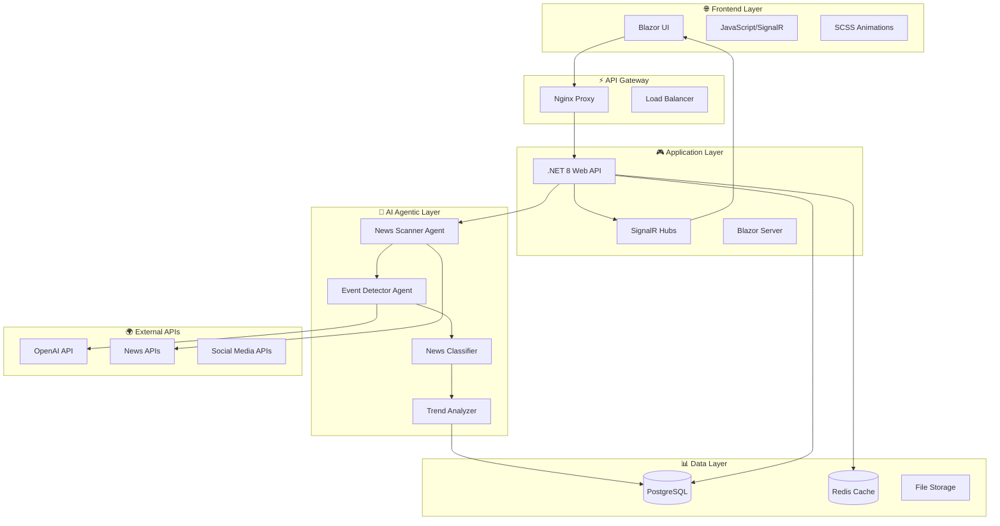
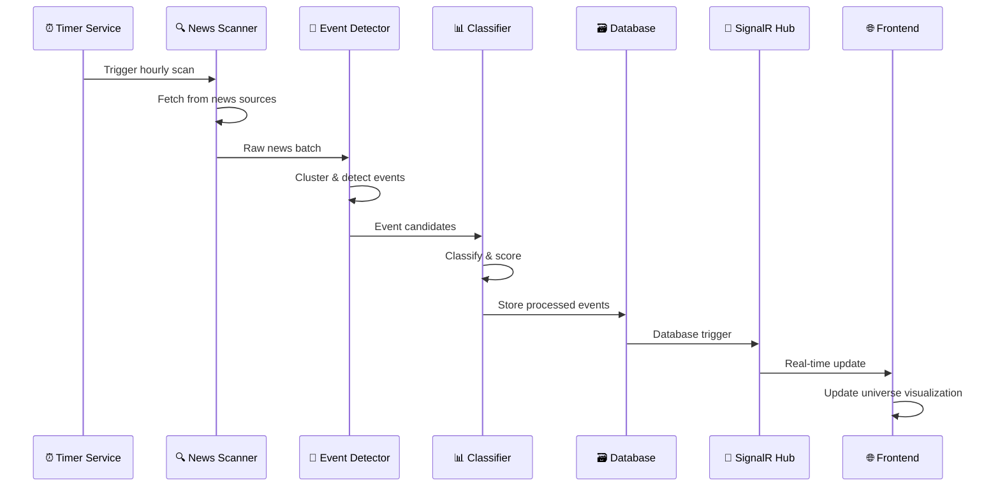

# 🏗️ ARQUITECTURA DEL SISTEMA AGÉNTICO

## 📋 **ÍNDICE**

1. [Visión General de Arquitectura](#visión-general)
2. [Arquitectura por Capas](#arquitectura-por-capas)
3. [Microservicios y Componentes](#microservicios)
4. [Flujo de Datos](#flujo-de-datos)
5. [Arquitectura de IA Agéntica](#arquitectura-ia)
6. [Escalabilidad y Performance](#escalabilidad)
7. [Seguridad y Resilencia](#seguridad)
8. [Patrones de Diseño](#patrones)

---

## 🎯 **VISIÓN GENERAL DE ARQUITECTURA**

### **Arquitectura de Alto Nivel**



### **Principios Arquitectónicos**

#### **🎯 SOLID + Clean Architecture**
- **Single Responsibility**: Cada agente tiene una responsabilidad específica
- **Open/Closed**: Extensible para nuevos tipos de agentes
- **Liskov Substitution**: Agentes intercambiables
- **Interface Segregation**: Contratos específicos por funcionalidad
- **Dependency Inversion**: Inyección de dependencias en toda la aplicación

#### **🔄 Event-Driven Architecture**
- **Domain Events** para comunicación entre bounded contexts
- **Integration Events** para comunicación entre microservicios
- **Command Query Responsibility Segregation (CQRS)** para lectura/escritura

#### **🤖 Agent-Oriented Architecture**
- **Autonomous Agents** con ciclos de vida independientes
- **Message Passing** entre agentes
- **Collaborative Intelligence** con agentes especializados

---

## 🏢 **ARQUITECTURA POR CAPAS**

### **Capa 1: Presentación (Frontend)**

```
┌─────────────────────────────────────────┐
│             PRESENTATION LAYER          │
├─────────────────────────────────────────┤
│  🎨 Blazor Components                   │
│  ├── NewsUniverseComponent              │
│  ├── EventDetailComponent               │
│  ├── SectionManagementComponent         │
│  └── AlertsComponent                    │
│                                         │
│  📱 JavaScript Modules                  │
│  ├── universe.js (Canvas/SVG)           │
│  ├── animations.js                      │
│  ├── signalr-client.js                  │
│  └── audio-alerts.js                    │
│                                         │
│  🎨 CSS Architecture                    │
│  ├── _layout.scss                       │
│  ├── _universe.scss                     │
│  ├── _animations.scss                   │
│  └── _components.scss                   │
└─────────────────────────────────────────┘
```

### **Capa 2: API y Aplicación**

```
┌─────────────────────────────────────────┐
│           APPLICATION LAYER             │
├─────────────────────────────────────────┤
│  🚀 Web API Controllers                 │
│  ├── NewsController                     │
│  ├── EventsController                   │
│  ├── SectionsController                 │
│  ├── AnalyticsController                │
│  └── AdminController                    │
│                                         │
│  🔄 SignalR Hubs                        │
│  ├── NewsHub (Tiempo real)              │
│  ├── AlertsHub (Alertas críticas)       │
│  └── AdminHub (Monitoreo)               │
│                                         │
│  🛡️ Middleware Pipeline                 │
│  ├── AuthenticationMiddleware           │
│  ├── RateLimitingMiddleware             │
│  ├── ExceptionHandlingMiddleware        │
│  └── RequestLoggingMiddleware           │
└─────────────────────────────────────────┘
```

### **Capa 3: Lógica de Negocio**

```
┌─────────────────────────────────────────┐
│            BUSINESS LAYER               │
├─────────────────────────────────────────┤
│  📋 Domain Services                     │
│  ├── NewsAggregationService             │
│  ├── EventDetectionService              │
│  ├── CredibilityAnalysisService         │
│  ├── TrendAnalysisService               │
│  └── NotificationService                │
│                                         │
│  🏛️ Domain Models                       │
│  ├── NewsEvent (Aggregate Root)         │
│  ├── NewsArticle (Entity)               │
│  ├── NewsSection (Entity)               │
│  ├── EventCluster (Value Object)        │
│  └── AnalyticsData (Value Object)       │
│                                         │
│  📜 Business Rules                      │
│  ├── EventPriorityCalculator            │
│  ├── NewsCredibilityValidator           │
│  ├── SectionAutoCreator                 │
│  └── AlertTriggerRules                  │
└─────────────────────────────────────────┘
```

### **Capa 4: IA Agéntica**

```
┌─────────────────────────────────────────┐
│            AI AGENTIC LAYER             │
├─────────────────────────────────────────┤
│  🤖 Autonomous Agents                   │
│  ├── NewsScanner                        │
│  │   ├── Keywords Extractor             │
│  │   ├── Source Validator               │
│  │   └── Content Scraper                │
│  │                                      │
│  ├── EventDetector                      │
│  │   ├── Clustering Algorithm           │
│  │   ├── Similarity Calculator          │
│  │   └── Impact Scorer                  │
│  │                                      │
│  ├── NewsClassifier                     │
│  │   ├── Category Predictor             │
│  │   ├── Sentiment Analyzer             │
│  │   └── Credibility Scorer             │
│  │                                      │
│  └── TrendAnalyzer                      │
│      ├── Pattern Recognizer             │
│      ├── Forecast Generator             │
│      └── Anomaly Detector               │
│                                         │
│  🧠 AI Services                         │
│  ├── OpenAI Integration                 │
│  ├── Claude Integration                 │
│  ├── Local LLM Fallback                 │
│  └── Prompt Engineering                 │
└─────────────────────────────────────────┘
```

### **Capa 5: Infraestructura**

```
┌─────────────────────────────────────────┐
│          INFRASTRUCTURE LAYER           │
├─────────────────────────────────────────┤
│  🗃️ Data Persistence                    │
│  ├── PostgreSQL Context                 │
│  ├── Redis Cache Context                │
│  ├── File Storage Context               │
│  └── Backup Manager                     │
│                                         │
│  🌐 External Integrations               │
│  ├── News API Clients                   │
│  ├── Social Media Clients               │
│  ├── AI Service Clients                 │
│  └── Notification Providers             │
│                                         │
│  📊 Cross-Cutting Concerns              │
│  ├── Logging (Serilog)                  │
│  ├── Monitoring (Prometheus)            │
│  ├── Health Checks                      │
│  └── Configuration Management           │
└─────────────────────────────────────────┘
```

---

## 🔧 **MICROSERVICIOS Y COMPONENTES**

### **Arquitectura de Microservicios Modulares**

#### **📰 News Aggregation Service**
```csharp
// Responsabilidades
- Escaneo de fuentes RSS/APIs
- Deduplicación de contenido
- Extracción de metadatos
- Almacenamiento inicial

// Interfaces
public interface INewsAggregationService
{
    Task<List<RawNewsItem>> ScanAllSources();
    Task<RawNewsItem> ProcessSingleSource(NewsSource source);
    Task<bool> IsDuplicate(RawNewsItem item);
    Task Store(List<RawNewsItem> items);
}

// Configuración
{
  "scanIntervalMinutes": 60,
  "maxItemsPerScan": 1000,
  "sources": [
    {
      "name": "Reuters",
      "url": "https://feeds.reuters.com/news",
      "credibilityScore": 95,
      "language": "en"
    }
  ]
}
```

#### **🧠 Event Detection Service**
```csharp
// Responsabilidades
- Análisis de clusters de noticias
- Detección de eventos principales
- Cálculo de relevancia
- Creación de jerarquías

// Algoritmos utilizados
- TF-IDF para similitud de texto
- DBSCAN para clustering
- PageRank para relevancia
- Sentiment Analysis para polaridad

// Pipeline de procesamiento
1. Text Preprocessing (tokenización, stemming)
2. Feature Extraction (TF-IDF, embeddings)
3. Clustering (DBSCAN, K-means)
4. Event Ranking (impact score)
5. Hierarchy Creation (estrella-planeta-luna)
```

#### **🤖 AI Orchestrator Service**
```csharp
// Responsabilidades
- Coordinación de agentes IA
- Gestión de prompts
- Rate limiting de APIs
- Fallback entre proveedores

// Configuración de Agentes
{
  "agents": {
    "newsScanner": {
      "enabled": true,
      "intervalHours": 1,
      "concurrency": 5
    },
    "eventDetector": {
      "enabled": true,
      "batchSize": 100,
      "threshold": 0.75
    },
    "trendAnalyzer": {
      "enabled": true,
      "lookbackHours": 24,
      "predictionHours": 48
    }
  }
}
```

---

## 📊 **FLUJO DE DATOS**

### **Pipeline de Procesamiento de Noticias**



### **Flujo de Detección de Eventos**

1. **📥 INGESTA**
   ```
   RSS Feeds → Raw Content → Text Extraction → Metadata
   ```

2. **🧹 LIMPIEZA**
   ```
   Deduplication → Language Detection → Content Validation
   ```

3. **🤖 PROCESAMIENTO IA**
   ```
   Summarization → Entity Extraction → Sentiment Analysis
   ```

4. **🔗 CLUSTERING**
   ```
   Similarity Calculation → Event Grouping → Hierarchy Creation
   ```

5. **📊 ANÁLISIS**
   ```
   Impact Scoring → Trend Detection → Alert Generation
   ```

6. **💾 ALMACENAMIENTO**
   ```
   Database Update → Cache Invalidation → Index Update
   ```

7. **📡 DISTRIBUCIÓN**
   ```
   SignalR Broadcast → UI Update → Notification Triggers
   ```

---

## 🤖 **ARQUITECTURA DE IA AGÉNTICA**

### **Modelo de Agentes Autónomos**

#### **🕷️ News Scanner Agent**
```csharp
public class NewsScannerAgent : IAutonomousAgent
{
    // Estado interno
    private readonly AgentState _state;
    private readonly List<NewsSource> _sources;
    
    // Ciclo de vida
    public async Task ExecuteCycle()
    {
        // 1. Planificación
        var plan = await CreateScanPlan();
        
        // 2. Ejecución
        var results = await ExecutePlan(plan);
        
        // 3. Comunicación
        await NotifyOtherAgents(results);
        
        // 4. Aprendizaje
        await UpdateKnowledge(results);
    }
    
    // Comunicación entre agentes
    public async Task ReceiveMessage(AgentMessage message)
    {
        switch (message.Type)
        {
            case "NEW_SECTION_CREATED":
                await AddSourcesForSection(message.Data);
                break;
            case "SOURCE_QUALITY_UPDATE":
                await UpdateSourceCredibility(message.Data);
                break;
        }
    }
}
```

#### **🧠 Event Detector Agent**
```csharp
public class EventDetectorAgent : IAutonomousAgent
{
    // Algoritmos de detección
    private readonly IClusteringAlgorithm _clustering;
    private readonly ISimilarityCalculator _similarity;
    private readonly IImpactScorer _impactScorer;
    
    public async Task<List<NewsEvent>> DetectEvents(List<RawNewsItem> news)
    {
        // Paso 1: Preparación de datos
        var features = await ExtractFeatures(news);
        
        // Paso 2: Clustering
        var clusters = await _clustering.Cluster(features);
        
        // Paso 3: Validación de eventos
        var validEvents = await ValidateEventsWithAI(clusters);
        
        // Paso 4: Jerarquización
        var hierarchicalEvents = await CreateHierarchy(validEvents);
        
        return hierarchicalEvents;
    }
    
    private async Task<List<NewsEvent>> ValidateEventsWithAI(List<NewsCluster> clusters)
    {
        var prompt = BuildValidationPrompt(clusters);
        var aiResponse = await _aiService.ProcessPrompt(prompt);
        return ParseValidatedEvents(aiResponse);
    }
}
```

### **Patrón Multi-Agent System (MAS)**

```
🤖 Agent Ecosystem

┌─────────────────┐    ┌─────────────────┐    ┌─────────────────┐
│  News Scanner   │───▶│ Event Detector  │───▶│ News Classifier │
│                 │    │                 │    │                 │
│ - Source Mgmt   │    │ - Clustering    │    │ - Categorization│
│ - Content Fetch │    │ - Impact Score  │    │ - Sentiment     │
│ - Deduplication │    │ - Validation    │    │ - Credibility   │
└─────────────────┘    └─────────────────┘    └─────────────────┘
         │                       │                       │
         ▼                       ▼                       ▼
┌─────────────────┐    ┌─────────────────┐    ┌─────────────────┐
│ Section Manager │    │ Trend Analyzer  │    │ Alert Generator │
│                 │    │                 │    │                 │
│ - Auto Creation │    │ - Pattern Recog │    │ - Critical Det  │
│ - Keywords Mgmt │    │ - Forecasting   │    │ - Notification  │
│ - User Requests │    │ - Anomaly Det   │    │ - Sound/Visual  │
└─────────────────┘    └─────────────────┘    └─────────────────┘
```

---

## ⚡ **ESCALABILIDAD Y PERFORMANCE**

### **Estrategias de Escalabilidad**

#### **🔄 Escalabilidad Horizontal**
```yaml
# Docker Swarm / Kubernetes
services:
  agentic-news:
    replicas: 3
    deploy:
      resources:
        limits:
          cpus: '2'
          memory: 4G
        reservations:
          cpus: '1'
          memory: 2G
  
  news-scanner:
    replicas: 2
    deploy:
      placement:
        constraints:
          - node.labels.workload == compute
  
  event-detector:
    replicas: 2
    deploy:
      resources:
        limits:
          cpus: '4'  # CPU intensive
          memory: 8G
```

#### **💾 Optimización de Base de Datos**
```sql
-- Índices optimizados
CREATE INDEX CONCURRENTLY idx_news_published_at 
ON news_articles (published_at DESC);

CREATE INDEX CONCURRENTLY idx_events_priority_impact 
ON news_events (priority, impact_score DESC);

CREATE INDEX CONCURRENTLY idx_articles_event_relevance 
ON news_articles (parent_event_id, relevance DESC);

-- Particionado por fechas
CREATE TABLE news_articles_y2026m03 
PARTITION OF news_articles 
FOR VALUES FROM ('2026-03-01') TO ('2026-04-01');

-- Materialised views para analytics
CREATE MATERIALIZED VIEW mv_hourly_stats AS
SELECT 
    date_trunc('hour', created_at) as hour,
    COUNT(*) as articles_count,
    AVG(impact_score) as avg_impact
FROM news_events 
GROUP BY hour;
```

#### **🚀 Cache Strategy**
```csharp
// Multi-layer caching
public class CacheStrategy
{
    // L1: In-Memory (fastest, ~1ms)
    private readonly IMemoryCache _memoryCache;
    
    // L2: Redis (fast, ~10ms)
    private readonly IDistributedCache _redisCache;
    
    // L3: Database (slower, ~100ms)
    private readonly INewsRepository _repository;
    
    public async Task<NewsEvent> GetEvent(int id)
    {
        // Try L1 first
        if (_memoryCache.TryGetValue($"event:{id}", out NewsEvent cached))
            return cached;
        
        // Try L2
        var redisValue = await _redisCache.GetStringAsync($"event:{id}");
        if (redisValue != null)
        {
            var fromRedis = JsonSerializer.Deserialize<NewsEvent>(redisValue);
            _memoryCache.Set($"event:{id}", fromRedis, TimeSpan.FromMinutes(5));
            return fromRedis;
        }
        
        // Fallback to L3
        var fromDb = await _repository.GetById(id);
        if (fromDb != null)
        {
            await _redisCache.SetStringAsync($"event:{id}", 
                JsonSerializer.Serialize(fromDb), 
                new DistributedCacheEntryOptions { SlidingExpiration = TimeSpan.FromHours(1) });
            
            _memoryCache.Set($"event:{id}", fromDb, TimeSpan.FromMinutes(5));
        }
        
        return fromDb;
    }
}
```

### **🏁 Métricas de Performance**

```csharp
// Performance targets
public static class PerformanceTargets
{
    public const int MaxNewsProcessingTimeMs = 30000;  // 30s para procesar 100 noticias
    public const int MaxEventDetectionTimeMs = 60000;  // 1min para detectar eventos
    public const int MaxApiResponseTimeMs = 1000;      // 1s para APIs REST
    public const int MaxSignalRLatencyMs = 100;        // 100ms para updates en tiempo real
    public const int MaxMemoryUsageMB = 2048;          // 2GB max por instancia
    public const double MinCpuEfficiency = 0.7;        // 70% eficiencia CPU
}

// Monitoring
public class PerformanceMonitor
{
    public async Task MonitorNewsProcessing()
    {
        using var activity = _telemetry.StartActivity("news.processing");
        var stopwatch = Stopwatch.StartNew();
        
        try
        {
            await ProcessNewsItems();
            
            activity?.SetTag("duration.ms", stopwatch.ElapsedMilliseconds);
            activity?.SetTag("status", "success");
            
            if (stopwatch.ElapsedMilliseconds > PerformanceTargets.MaxNewsProcessingTimeMs)
            {
                _logger.LogWarning("News processing exceeded target time: {ElapsedMs}ms", 
                    stopwatch.ElapsedMilliseconds);
            }
        }
        catch (Exception ex)
        {
            activity?.SetTag("status", "error");
            activity?.SetTag("error.message", ex.Message);
            throw;
        }
    }
}
```

---

## 🛡️ **SEGURIDAD Y RESILENCIA**

### **🔐 Arquitectura de Seguridad**

#### **Autenticación y Autorización**
```csharp
// JWT Configuration
public class JwtConfiguration
{
    public string SecretKey { get; set; }
    public string Issuer { get; set; } = "agentic-news";
    public string Audience { get; set; } = "agentic-news-users";
    public int ExpirationHours { get; set; } = 24;
}

// Claims-based Authorization
[Authorize(Roles = "Admin,Analyst")]
public class AdminController : ControllerBase
{
    [HttpPost("sections")]
    [Authorize(Policy = "CanCreateSections")]
    public async Task<IActionResult> CreateSection([FromBody] CreateSectionRequest request)
    {
        // Implementation
    }
}

// Custom Authorization Policies
services.AddAuthorization(options =>
{
    options.AddPolicy("CanCreateSections", policy =>
        policy.RequireRole("Admin").OrClaim("permissions", "create:sections"));
    
    options.AddPolicy("CanViewClassifiedInfo", policy =>
        policy.RequireClaim("security_clearance", "confidential", "secret", "top_secret"));
});
```

#### **🔒 Data Encryption**
```csharp
// Encryption at Rest
public class EncryptedNewsArticle
{
    public string EncryptedContent { get; set; }
    public string EncryptionKeyId { get; set; }
    
    [NotMapped]
    public string Content 
    { 
        get => _encryptionService.Decrypt(EncryptedContent, EncryptionKeyId);
        set => EncryptedContent = _encryptionService.Encrypt(value, EncryptionKeyId);
    }
}

// Key Management
public interface IKeyManagementService
{
    Task<string> CreateKey(string purpose);
    Task<string> GetKey(string keyId);
    Task RotateKey(string keyId);
    Task RevokeKey(string keyId);
}
```

### **🛡️ Resilencia y Disaster Recovery**

#### **Circuit Breaker Pattern**
```csharp
public class NewsApiClient
{
    private readonly ICircuitBreaker _circuitBreaker;
    
    public async Task<List<NewsItem>> FetchNews(string source)
    {
        return await _circuitBreaker.ExecuteAsync(async () =>
        {
            var response = await _httpClient.GetAsync($"/api/news/{source}");
            response.EnsureSuccessStatusCode();
            
            var json = await response.Content.ReadAsStringAsync();
            return JsonSerializer.Deserialize<List<NewsItem>>(json);
        });
    }
}

// Circuit Breaker Configuration
services.AddHttpClient<NewsApiClient>()
    .AddPolicyHandler(GetRetryPolicy())
    .AddPolicyHandler(GetCircuitBreakerPolicy());

static IAsyncPolicy<HttpResponseMessage> GetCircuitBreakerPolicy()
{
    return HttpPolicyExtensions
        .HandleTransientHttpError()
        .CircuitBreakerAsync(
            handledEventsAllowedBeforeBreaking: 3,
            durationOfBreak: TimeSpan.FromSeconds(30));
}
```

#### **📦 Backup Strategy**
```yaml
# Automated Backups
backup:
  database:
    schedule: "0 2 * * *"  # Daily at 2 AM
    retention: 30          # Keep 30 days
    encryption: true
    destinations:
      - local: /backups/db
      - s3: s3://agentic-news-backups/db
  
  redis:
    schedule: "0 */6 * * *"  # Every 6 hours
    retention: 7             # Keep 7 days
    
  application:
    schedule: "0 3 * * 0"    # Weekly on Sunday
    retention: 12            # Keep 12 weeks
```

---

## 🎨 **PATRONES DE DISEÑO**

### **🏗️ Architectural Patterns**

#### **Domain-Driven Design (DDD)**
```csharp
// Aggregate Root
public class NewsEvent : AggregateRoot<int>
{
    private readonly List<NewsArticle> _articles = new();
    
    public void AddArticle(NewsArticle article)
    {
        // Business rules
        if (_articles.Count >= 50)
            throw new DomainException("Event cannot have more than 50 articles");
        
        if (article.Credibility < 60)
            throw new DomainException("Article credibility too low");
        
        _articles.Add(article);
        
        // Domain event
        AddDomainEvent(new ArticleAddedToEventDomainEvent(Id, article.Id));
    }
}

// Domain Service
public class EventPriorityCalculator : IDomainService
{
    public EventPriority Calculate(NewsEvent newsEvent)
    {
        var impactScore = newsEvent.ImpactScore;
        var articlesCount = newsEvent.Articles.Count;
        var averageCredibility = newsEvent.Articles.Average(a => a.Credibility);
        
        // Complex business logic
        if (impactScore > 90 && articlesCount > 10 && averageCredibility > 80)
            return EventPriority.Critical;
        
        // More rules...
        return EventPriority.Medium;
    }
}
```

#### **Command Query Responsibility Segregation (CQRS)**
```csharp
// Commands (Write Side)
public class CreateNewsEventCommand : ICommand<int>
{
    public string Title { get; set; }
    public string Description { get; set; }
    public EventCategory Category { get; set; }
    public List<int> ArticleIds { get; set; }
}

public class CreateNewsEventHandler : ICommandHandler<CreateNewsEventCommand, int>
{
    public async Task<int> Handle(CreateNewsEventCommand command)
    {
        var newsEvent = NewsEvent.Create(command.Title, command.Description);
        await _repository.Add(newsEvent);
        
        // Publish integration event
        await _eventBus.Publish(new NewsEventCreatedEvent(newsEvent.Id));
        
        return newsEvent.Id;
    }
}

// Queries (Read Side)
public class GetNewsEventsQuery : IQuery<List<NewsEventDto>>
{
    public EventCategory? Category { get; set; }
    public EventPriority? Priority { get; set; }
    public DateTime? FromDate { get; set; }
    public int PageSize { get; set; } = 20;
    public int PageNumber { get; set; } = 1;
}

public class GetNewsEventsHandler : IQueryHandler<GetNewsEventsQuery, List<NewsEventDto>>
{
    public async Task<List<NewsEventDto>> Handle(GetNewsEventsQuery query)
    {
        // Optimized read queries
        var sql = BuildOptimizedQuery(query);
        var events = await _dbContext.QueryAsync<NewsEventDto>(sql);
        return events.ToList();
    }
}
```

#### **Event Sourcing para Auditoría**
```csharp
// Event Store
public class NewsEventEventStore
{
    public async Task SaveEvents(int eventId, IEnumerable<IDomainEvent> events)
    {
        foreach (var @event in events)
        {
            var eventData = new EventData
            {
                EventId = eventId,
                EventType = @event.GetType().Name,
                Data = JsonSerializer.Serialize(@event),
                Timestamp = DateTime.UtcNow,
                Version = await GetNextVersion(eventId)
            };
            
            await _context.Events.AddAsync(eventData);
        }
    }
    
    public async Task<NewsEvent> RehydrateFromEvents(int eventId)
    {
        var events = await GetEventHistory(eventId);
        var newsEvent = new NewsEvent();
        
        foreach (var eventData in events.OrderBy(e => e.Version))
        {
            var domainEvent = DeserializeEvent(eventData);
            newsEvent.ApplyEvent(domainEvent);
        }
        
        return newsEvent;
    }
}
```

---

## 📊 **MÉTRICAS Y OBSERVABILIDAD**

### **🔍 Monitoring Stack**
```csharp
// Application Performance Monitoring
public class TelemetryConfiguration
{
    public static void ConfigureServices(IServiceCollection services)
    {
        services.AddApplicationInsightsTelemetry();
        
        services.AddOpenTelemetry()
            .WithTracing(builder =>
            {
                builder
                    .AddAspNetCoreInstrumentation()
                    .AddEntityFrameworkCoreInstrumentation()
                    .AddRedisInstrumentation()
                    .AddConsoleExporter()
                    .AddJaegerExporter();
            })
            .WithMetrics(builder =>
            {
                builder
                    .AddAspNetCoreInstrumentation()
                    .AddRuntimeInstrumentation()
                    .AddProcessInstrumentation()
                    .AddPrometheusExporter();
            });
    }
}

// Custom Metrics
public class NewsMetrics
{
    private static readonly Counter ArticlesProcessed = 
        Metrics.CreateCounter("articles_processed_total", "Total processed articles");
    
    private static readonly Histogram ProcessingTime = 
        Metrics.CreateHistogram("article_processing_duration_seconds", 
            "Time spent processing articles");
    
    private static readonly Gauge ActiveEvents = 
        Metrics.CreateGauge("active_events_count", "Number of active events");
}
```

---

## ✅ **CHECKLIST DE IMPLEMENTACIÓN**

### **Phase 1: Core Infrastructure** ✅
- [x] Configurar PostgreSQL con esquemas
- [x] Implementar Redis para cache
- [x] Configurar Docker Compose
- [x] Setupar logging con Serilog

### **Phase 2: Basic Services** 🔄
- [ ] Implementar NewsAggregationService
- [ ] Crear basic event detection
- [ ] Implementar API controllers básicos
- [ ] Configurar SignalR hubs

### **Phase 3: AI Integration** 📋
- [ ] Integrar OpenAI/Claude APIs
- [ ] Implementar prompt engineering
- [ ] Crear agentes autónomos
- [ ] Implementar classification algorithms

### **Phase 4: Frontend** 📋
- [ ] Crear Blazor components
- [ ] Implementar universe visualization
- [ ] Configurar real-time updates
- [ ] Añadir responsive design

### **Phase 5: Advanced Features** 📋
- [ ] Implementar section auto-creation
- [ ] Crear analytics dashboard
- [ ] Añadir alerting system
- [ ] Configurar monitoring

---

**📝 Nota**: Esta arquitectura está diseñada para ser modular y escalable. Cada componente puede desarrollarse e implementarse independientemente, siguiendo principios de desarrollo ágil.

---

**Última actualización**: 6 de Marzo, 2026  
**Revisión**: v1.0  
**Estado**: 📋 Design Complete - Ready for Implementation
