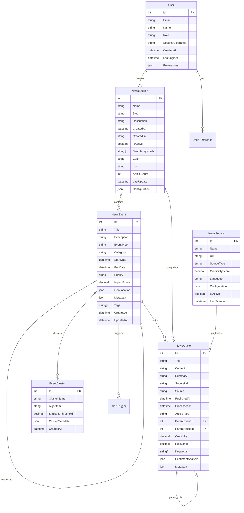

# 🗃️ MODELO DE DATOS DEL SISTEMA AGÉNTICO

## 📋 **ÍNDICE**

1. [Diagrama de Entidad-Relación](#diagrama-er)
2. [Entidades Principales](#entidades-principales)
3. [Esquemas de Base de Datos](#esquemas-bd)
4. [Modelos C# (Domain Objects)](#modelos-csharp)
5. [DTOs y ViewModels](#dtos-viewmodels)
6. [Migraciones y Seeding](#migraciones)
7. [Índices y Performance](#indices-performance)
8. [Auditoría y Versionado](#auditoria)

---

## 🎯 **DIAGRAMA ENTIDAD-RELACIÓN**



---

## 🏛️ **ENTIDADES PRINCIPALES**

### **🌟 NewsEvent (Estrella Central)**

La entidad principal que representa un evento de noticias que actúa como "estrella" en nuestro universo.

```csharp
public class NewsEvent : BaseEntity
{
    // Identificación
    public int Id { get; set; }
    public string Title { get; set; } = string.Empty;
    public string Description { get; set; } = string.Empty;
    
    // Clasificación
    public EventType Type { get; set; } = EventType.Developing;
    public EventCategory Category { get; set; } = EventCategory.General;
    public EventPriority Priority { get; set; } = EventPriority.Medium;
    
    // Temporalidad
    public DateTime StartDate { get; set; }
    public DateTime? EndDate { get; set; }
    public TimeSpan? Duration => EndDate?.Subtract(StartDate);
    
    // Métricas de Impacto
    public decimal ImpactScore { get; set; } // 0-100
    public int ArticlesCount => OrbitingArticles?.Count ?? 0;
    public decimal AverageCredibility => OrbitingArticles?.Average(a => a.Credibility) ?? 0;
    
    // Ubicación Geográfica (JSON)
    public GeoLocation? Location { get; set; }
    
    // Metadatos Extensibles
    public Dictionary<string, object> Metadata { get; set; } = new();
    public string[] Tags { get; set; } = Array.Empty<string>();
    
    // Relaciones
    public virtual ICollection<NewsArticle> OrbitingArticles { get; set; } = new List<NewsArticle>();
    public virtual ICollection<NewsEvent> RelatedEvents { get; set; } = new List<NewsEvent>();
    public virtual ICollection<NewsEvent> ParentEvents { get; set; } = new List<NewsEvent>();
    public virtual NewsSection Section { get; set; } = null!;
    public int SectionId { get; set; }
    
    // Auditoría
    public DateTime CreatedAt { get; set; } = DateTime.UtcNow;
    public DateTime UpdatedAt { get; set; } = DateTime.UtcNow;
    public string CreatedBy { get; set; } = "System";
    
    // Propiedades Calculadas
    [NotMapped]
    public bool IsCritical => Priority == EventPriority.Critical;
    
    [NotMapped]
    public bool IsActive => EndDate == null || EndDate > DateTime.UtcNow;
    
    [NotMapped]
    public EventTrend Trend { get; set; } = EventTrend.Stable;
}

// Enums
public enum EventType
{
    Breaking = 1,     // Noticia de último momento
    Developing = 2,   // En desarrollo
    Ongoing = 3,      // Evento continuo
    Resolved = 4      // Evento finalizado
}

public enum EventCategory
{
    NBQ = 1,           // Nuclear, Biológico, Químico
    Politics = 2,      // Política
    Economics = 3,     // Economía
    Technology = 4,    // Tecnología
    Sports = 5,        // Deportes
    Entertainment = 6, // Entretenimiento/Prensa Rosa
    Health = 7,        // Salud
    Environment = 8,   // Medio Ambiente
    International = 9, // Internacional
    General = 10       // General
}

public enum EventPriority
{
    Low = 1,
    Medium = 2,
    High = 3,
    Critical = 4
}

public enum EventTrend
{
    Declining = -2,    // ↓↓ Declinando rápidamente
    Decreasing = -1,   // ↓ Decreciendo
    Stable = 0,        // → Estable
    Increasing = 1,    // ↑ Creciendo
    Surging = 2        // ↑↑ Incrementando rápidamente
}
```

### **🪐 NewsArticle (Planetas y Lunas)**

Representa artículos individuales que orbitan alrededor de eventos principales.

```csharp
public class NewsArticle : BaseEntity
{
    // Identificación
    public int Id { get; set; }
    public string Title { get; set; } = string.Empty;
    public string Content { get; set; } = string.Empty;
    public string Summary { get; set; } = string.Empty; // Generado por IA
    
    // Fuente
    public string SourceUrl { get; set; } = string.Empty;
    public string Source { get; set; } = string.Empty;
    public int? NewsSourceId { get; set; }
    public virtual NewsSource? NewsSource { get; set; }
    
    // Temporalidad
    public DateTime PublishedAt { get; set; }
    public DateTime ProcessedAt { get; set; } = DateTime.UtcNow;
    
    // Jerarquía (Sistema Solar)
    public ArticleType Type { get; set; } = ArticleType.Secondary;
    public int? ParentEventId { get; set; }  // Estrella padre
    public virtual NewsEvent? ParentEvent { get; set; }
    public int? ParentArticleId { get; set; } // Planeta padre (si es luna)
    public virtual NewsArticle? ParentArticle { get; set; }
    public virtual ICollection<NewsArticle> ChildArticles { get; set; } = new List<NewsArticle>(); // Lunas
    
    // Métricas de IA
    public decimal Credibility { get; set; } = 50.0m; // 0-100
    public decimal Relevance { get; set; } = 50.0m;   // 0-100 relevancia al evento
    
    // Análisis de Contenido
    public string[] Keywords { get; set; } = Array.Empty<string>();
    public SentimentAnalysis SentimentAnalysis { get; set; } = new();
    public Dictionary<string, object> Metadata { get; set; } = new();
    
    // Sección
    public int? SectionId { get; set; }
    public virtual NewsSection? Section { get; set; }
    
    // Ubicación (si aplica)
    public GeoLocation? Location { get; set; }
    
    // Auditoría
    public DateTime CreatedAt { get; set; } = DateTime.UtcNow;
    public DateTime UpdatedAt { get; set; } = DateTime.UtcNow;
    
    // Propiedades Calculadas
    [NotMapped]
    public bool IsMainPlanet => Type == ArticleType.Primary && ParentArticleId == null;
    
    [NotMapped]
    public bool IsMoon => ParentArticleId != null;
    
    [NotMapped]
    public int DepthLevel
    {
        get
        {
            if (ParentArticleId == null) return 0; // Planeta
            return (ParentArticle?.DepthLevel ?? 0) + 1; // Luna (o luna de luna...)
        }
    }
    
    [NotMapped]
    public bool IsHighCredibility => Credibility >= 80.0m;
}

public enum ArticleType
{
    Primary = 1,      // Planeta principal
    Secondary = 2,    // Planeta secundario
    Analysis = 3,     // Análisis/Opinión
    Update = 4,       // Actualización/Seguimiento
    Related = 5       // Relacionado
}

// Análisis de Sentimientos
public class SentimentAnalysis
{
    public decimal Positive { get; set; } = 0.0m;  // 0-100
    public decimal Negative { get; set; } = 0.0m;  // 0-100
    public decimal Neutral { get; set; } = 100.0m; // 0-100
    public decimal Confidence { get; set; } = 0.0m; // 0-100
    public string OverallSentiment { get; set; } = "Neutral";
}
```

### **📊 NewsSection (Secciones Dinámicas)**

Representa secciones de noticias que se crean dinámicamente.

```csharp
public class NewsSection : BaseEntity
{
    // Identificación
    public int Id { get; set; }
    public string Name { get; set; } = string.Empty; // "NBQ", "Prensa Rosa España"
    public string Slug { get; set; } = string.Empty; // "nbq", "prensa-rosa-espana"
    public string Description { get; set; } = string.Empty;
    
    // Configuración Visual
    public string Color { get; set; } = "#3498db"; // Color hex
    public string Icon { get; set; } = "fas fa-newspaper"; // FontAwesome icon
    
    // Configuración de IA
    public string[] SearchKeywords { get; set; } = Array.Empty<string>();
    public SectionConfiguration Configuration { get; set; } = new();
    
    // Gestión
    public DateTime CreatedAt { get; set; } = DateTime.UtcNow;
    public string CreatedBy { get; set; } = "System"; // "System" o "User:email"
    public bool IsActive { get; set; } = true;
    public bool IsSystemSection { get; set; } = false; // NBQ es system section
    
    // Estadísticas (actualizado por background service)
    public int ArticleCount { get; set; } = 0;
    public int EventCount { get; set; } = 0;
    public DateTime LastUpdate { get; set; } = DateTime.UtcNow;
    public decimal AverageImpactScore { get; set; } = 0.0m;
    
    // Relaciones
    public virtual ICollection<NewsEvent> Events { get; set; } = new List<NewsEvent>();
    public virtual ICollection<NewsArticle> Articles { get; set; } = new List<NewsArticle>();
    public virtual User? Creator { get; set; }
    public string? CreatedByUserId { get; set; }
    
    // Propiedades Calculadas
    [NotMapped]
    public bool IsPopular => ArticleCount > 50;
    
    [NotMapped]
    public bool IsRecent => CreatedAt > DateTime.UtcNow.AddDays(-7);
    
    [NotMapped]
    public string DisplayName => Name;
    
    [NotMapped]
    public string Url => $"/sections/{Slug}";
}

public class SectionConfiguration
{
    public int ScanIntervalHours { get; set; } = 1;
    public int MaxArticlesPerScan { get; set; } = 100;
    public decimal MinCredibilityScore { get; set; } = 60.0m;
    public bool EnableAlerts { get; set; } = true;
    public string[] ExcludedSources { get; set; } = Array.Empty<string>();
    public string[] PreferredLanguages { get; set; } = { "es", "en" };
    public Dictionary<string, object> CustomSettings { get; set; } = new();
}
```

### **🔗 EventCluster (Agrupaciones de Eventos)**

Representa clusters de eventos relacionados detectados por IA.

```csharp
public class EventCluster : BaseEntity
{
    // Identificación
    public int Id { get; set; }
    public string ClusterName { get; set; } = string.Empty;
    public string Description { get; set; } = string.Empty;
    
    // Algoritmo de Clustering
    public string Algorithm { get; set; } = "DBSCAN"; // DBSCAN, K-means, etc.
    public decimal SimilarityThreshold { get; set; } = 0.75m; // 0-1
    public ClusterMetadata Metadata { get; set; } = new();
    
    // Relaciones
    public virtual ICollection<NewsEvent> Events { get; set; } = new List<NewsEvent>();
    
    // Estadísticas
    public int EventCount => Events?.Count ?? 0;
    public decimal AverageImpactScore => Events?.Average(e => e.ImpactScore) ?? 0;
    
    // Auditoría
    public DateTime CreatedAt { get; set; } = DateTime.UtcNow;
    public DateTime UpdatedAt { get; set; } = DateTime.UtcNow;
    
    // Propiedades Calculadas
    [NotMapped]
    public bool IsSignificant => EventCount >= 3 && AverageImpactScore >= 70;
}

public class ClusterMetadata
{
    public string[] CommonKeywords { get; set; } = Array.Empty<string>();
    public GeoLocation? CenterLocation { get; set; }
    public Dictionary<string, decimal> Weights { get; set; } = new();
    public string ClusterVisualization { get; set; } = string.Empty; // JSON para D3.js
}
```

### **🚨 AlertTrigger (Alertas Automáticas)**

Gestiona alertas automáticas basadas en eventos críticos.

```csharp
public class AlertTrigger : BaseEntity
{
    // Identificación
    public int Id { get; set; }
    public string Name { get; set; } = string.Empty;
    public string Description { get; set; } = string.Empty;
    
    // Configuración de Trigger
    public AlertType Type { get; set; } = AlertType.EventPriority;
    public AlertCondition Condition { get; set; } = new();
    
    // Acciones
    public AlertAction[] Actions { get; set; } = Array.Empty<AlertAction>();
    
    // Estado
    public bool IsActive { get; set; } = true;
    public int TriggerCount { get; set; } = 0;
    public DateTime? LastTriggered { get; set; }
    
    // Relaciones
    public int? TargetEventId { get; set; }
    public virtual NewsEvent? TargetEvent { get; set; }
    
    // Auditoría
    public DateTime CreatedAt { get; set; } = DateTime.UtcNow;
    public DateTime UpdatedAt { get; set; } = DateTime.UtcNow;
}

public enum AlertType
{
    EventPriority = 1,    // Por prioridad del evento
    ImpactScore = 2,      // Por score de impacto
    KeywordMatch = 3,     // Por palabras clave
    VelocityChange = 4,   // Por cambio de velocidad
    CredibilityDrop = 5   // Por caída de credibilidad
}

public class AlertCondition
{
    public string Field { get; set; } = string.Empty; // "ImpactScore", "Priority", etc.
    public string Operator { get; set; } = ">="; // ">=", "<=", "==", "contains"
    public string Value { get; set; } = string.Empty;
    public Dictionary<string, object> Parameters { get; set; } = new();
}

public class AlertAction
{
    public string Type { get; set; } = string.Empty; // "Email", "Webhook", "SignalR", "Sound"
    public Dictionary<string, object> Configuration { get; set; } = new();
}
```

### **👤 User (Usuarios del Sistema)**

```csharp
public class User : IdentityUser
{
    // Información Personal
    public string FirstName { get; set; } = string.Empty;
    public string LastName { get; set; } = string.Empty;
    public string FullName => $"{FirstName} {LastName}".Trim();
    
    // Autorización
    public string Role { get; set; } = "User"; // User, Analyst, Admin
    public string SecurityClearance { get; set; } = "Public"; // Public, Restricted, Confidential, Secret
    
    // Preferencias
    public UserPreferences Preferences { get; set; } = new();
    
    // Actividad
    public DateTime CreatedAt { get; set; } = DateTime.UtcNow;
    public DateTime? LastLoginAt { get; set; }
    public bool IsActive { get; set; } = true;
    
    // Relaciones
    public virtual ICollection<NewsSection> CreatedSections { get; set; } = new List<NewsSection>();
}

public class UserPreferences
{
    public string[] PreferredSections { get; set; } = Array.Empty<string>();
    public string[] PreferredLanguages { get; set; } = { "es" };
    public bool EnableNotifications { get; set; } = true;
    public bool EnableSoundAlerts { get; set; } = true;
    public string Theme { get; set; } = "dark"; // dark, light
    public Dictionary<string, object> CustomSettings { get; set; } = new();
}
```

### **📰 NewsSource (Fuentes de Noticias)**

```csharp
public class NewsSource : BaseEntity
{
    // Identificación
    public int Id { get; set; }
    public string Name { get; set; } = string.Empty; // "Reuters", "BBC", "El País"
    public string Url { get; set; } = string.Empty;
    public string SourceType { get; set; } = "RSS"; // RSS, API, Web
    
    // Configuración
    public SourceConfiguration Configuration { get; set; } = new();
    
    // Calidad
    public decimal CredibilityScore { get; set; } = 75.0m; // 0-100
    public string Language { get; set; } = "es";
    public string Country { get; set; } = "ES";
    
    // Estado
    public bool IsActive { get; set; } = true;
    public DateTime? LastScanned { get; set; }
    public DateTime? LastSuccessfulScan { get; set; }
    public int ErrorCount { get; set; } = 0;
    public string? LastError { get; set; }
    
    // Estadísticas
    public int TotalArticlesScanned { get; set; } = 0;
    public decimal AverageArticlesPerScan { get; set; } = 0.0m;
    
    // Auditoría
    public DateTime CreatedAt { get; set; } = DateTime.UtcNow;
    public DateTime UpdatedAt { get; set; } = DateTime.UtcNow;
    
    // Relaciones
    public virtual ICollection<NewsArticle> Articles { get; set; } = new List<NewsArticle>();
}

public class SourceConfiguration
{
    public int ScanIntervalMinutes { get; set; } = 60;
    public int MaxArticlesPerScan { get; set; } = 50;
    public string[] ExcludedKeywords { get; set; } = Array.Empty<string>();
    public Dictionary<string, string> Headers { get; set; } = new();
    public string UserAgent { get; set; } = "Agentic News Bot 1.0";
    public int TimeoutSeconds { get; set; } = 30;
}
```

---

## 🗄️ **ESQUEMAS DE BASE DE DATOS**

### **SQL Schema (PostgreSQL)**

```sql
-- Extensiones necesarias
CREATE EXTENSION IF NOT EXISTS "uuid-ossp";
CREATE EXTENSION IF NOT EXISTS "pg_trgm";
CREATE EXTENSION IF NOT EXISTS "hstore";

-- Schema principal
CREATE SCHEMA IF NOT EXISTS agentic_news;

-- Tabla: news_sections
CREATE TABLE agentic_news.news_sections (
    id SERIAL PRIMARY KEY,
    name VARCHAR(200) NOT NULL,
    slug VARCHAR(200) UNIQUE NOT NULL,
    description TEXT,
    color VARCHAR(7) DEFAULT '#3498db',
    icon VARCHAR(100) DEFAULT 'fas fa-newspaper',
    search_keywords TEXT[], -- Array de keywords
    configuration JSONB DEFAULT '{}',
    created_at TIMESTAMPTZ DEFAULT NOW(),
    created_by VARCHAR(200) DEFAULT 'System',
    created_by_user_id UUID,
    is_active BOOLEAN DEFAULT true,
    is_system_section BOOLEAN DEFAULT false,
    article_count INTEGER DEFAULT 0,
    event_count INTEGER DEFAULT 0,
    last_update TIMESTAMPTZ DEFAULT NOW(),
    average_impact_score DECIMAL(5,2) DEFAULT 0.0,
    
    CONSTRAINT chk_color_format CHECK (color ~ '^#[0-9A-Fa-f]{6}$'),
    CONSTRAINT chk_impact_score CHECK (average_impact_score >= 0 AND average_impact_score <= 100)
);

-- Tabla: news_events (La Estrella)
CREATE TABLE agentic_news.news_events (
    id SERIAL PRIMARY KEY,
    title VARCHAR(500) NOT NULL,
    description TEXT,
    type VARCHAR(50) DEFAULT 'Developing', -- Breaking, Developing, Ongoing, Resolved
    category VARCHAR(50) DEFAULT 'General', -- NBQ, Politics, etc.
    priority VARCHAR(20) DEFAULT 'Medium', -- Low, Medium, High, Critical
    start_date TIMESTAMPTZ NOT NULL DEFAULT NOW(),
    end_date TIMESTAMPTZ,
    impact_score DECIMAL(5,2) DEFAULT 50.0,
    location JSONB, -- GeoLocation object
    metadata JSONB DEFAULT '{}',
    tags TEXT[],
    section_id INTEGER NOT NULL,
    created_at TIMESTAMPTZ DEFAULT NOW(),
    updated_at TIMESTAMPTZ DEFAULT NOW(),
    created_by VARCHAR(200) DEFAULT 'System',
    
    CONSTRAINT fk_events_section FOREIGN KEY (section_id) 
        REFERENCES agentic_news.news_sections(id) ON DELETE CASCADE,
    CONSTRAINT chk_impact_score CHECK (impact_score >= 0 AND impact_score <= 100),
    CONSTRAINT chk_valid_priority CHECK (priority IN ('Low', 'Medium', 'High', 'Critical')),
    CONSTRAINT chk_valid_type CHECK (type IN ('Breaking', 'Developing', 'Ongoing', 'Resolved'))
);

-- Tabla: news_sources
CREATE TABLE agentic_news.news_sources (
    id SERIAL PRIMARY KEY,
    name VARCHAR(200) NOT NULL,
    url TEXT NOT NULL,
    source_type VARCHAR(50) DEFAULT 'RSS',
    credibility_score DECIMAL(5,2) DEFAULT 75.0,
    language VARCHAR(5) DEFAULT 'es',
    country VARCHAR(5) DEFAULT 'ES',
    configuration JSONB DEFAULT '{}',
    is_active BOOLEAN DEFAULT true,
    last_scanned TIMESTAMPTZ,
    last_successful_scan TIMESTAMPTZ,
    error_count INTEGER DEFAULT 0,
    last_error TEXT,
    total_articles_scanned INTEGER DEFAULT 0,
    average_articles_per_scan DECIMAL(8,2) DEFAULT 0.0,
    created_at TIMESTAMPTZ DEFAULT NOW(),
    updated_at TIMESTAMPTZ DEFAULT NOW(),
    
    CONSTRAINT chk_credibility_score CHECK (credibility_score >= 0 AND credibility_score <= 100),
    CONSTRAINT uk_sources_url UNIQUE (url)
);

-- Tabla: news_articles (Planetas y Lunas)
CREATE TABLE agentic_news.news_articles (
    id SERIAL PRIMARY KEY,
    title TEXT NOT NULL,
    content TEXT,
    summary TEXT, -- Generado por IA
    source_url TEXT NOT NULL,
    source VARCHAR(200),
    news_source_id INTEGER,
    published_at TIMESTAMPTZ NOT NULL,
    processed_at TIMESTAMPTZ DEFAULT NOW(),
    type VARCHAR(50) DEFAULT 'Secondary', -- Primary, Secondary, Analysis, Update, Related
    parent_event_id INTEGER, -- Estrella padre
    parent_article_id INTEGER, -- Planeta padre (si es luna)
    credibility DECIMAL(5,2) DEFAULT 50.0,
    relevance DECIMAL(5,2) DEFAULT 50.0,
    keywords TEXT[],
    sentiment_analysis JSONB DEFAULT '{"positive": 0, "negative": 0, "neutral": 100, "confidence": 0, "overall": "Neutral"}',
    metadata JSONB DEFAULT '{}',
    location JSONB, -- GeoLocation
    section_id INTEGER,
    created_at TIMESTAMPTZ DEFAULT NOW(),
    updated_at TIMESTAMPTZ DEFAULT NOW(),
    
    CONSTRAINT fk_articles_parent_event FOREIGN KEY (parent_event_id) 
        REFERENCES agentic_news.news_events(id) ON DELETE CASCADE,
    CONSTRAINT fk_articles_parent_article FOREIGN KEY (parent_article_id) 
        REFERENCES agentic_news.news_articles(id) ON DELETE CASCADE,
    CONSTRAINT fk_articles_section FOREIGN KEY (section_id) 
        REFERENCES agentic_news.news_sections(id) ON DELETE SET NULL,
    CONSTRAINT fk_articles_source FOREIGN KEY (news_source_id) 
        REFERENCES agentic_news.news_sources(id) ON DELETE SET NULL,
    CONSTRAINT chk_credibility CHECK (credibility >= 0 AND credibility <= 100),
    CONSTRAINT chk_relevance CHECK (relevance >= 0 AND relevance <= 100),
    CONSTRAINT chk_no_self_parent CHECK (id != parent_article_id)
);

-- Tabla: event_clusters
CREATE TABLE agentic_news.event_clusters (
    id SERIAL PRIMARY KEY,
    cluster_name VARCHAR(300) NOT NULL,
    description TEXT,
    algorithm VARCHAR(100) DEFAULT 'DBSCAN',
    similarity_threshold DECIMAL(3,2) DEFAULT 0.75,
    metadata JSONB DEFAULT '{}',
    created_at TIMESTAMPTZ DEFAULT NOW(),
    updated_at TIMESTAMPTZ DEFAULT NOW(),
    
    CONSTRAINT chk_similarity_threshold CHECK (similarity_threshold >= 0 AND similarity_threshold <= 1)
);

-- Tabla many-to-many: event_cluster_events
CREATE TABLE agentic_news.event_cluster_events (
    cluster_id INTEGER NOT NULL,
    event_id INTEGER NOT NULL,
    added_at TIMESTAMPTZ DEFAULT NOW(),
    
    PRIMARY KEY (cluster_id, event_id),
    CONSTRAINT fk_cluster_events_cluster FOREIGN KEY (cluster_id) 
        REFERENCES agentic_news.event_clusters(id) ON DELETE CASCADE,
    CONSTRAINT fk_cluster_events_event FOREIGN KEY (event_id) 
        REFERENCES agentic_news.news_events(id) ON DELETE CASCADE
);

-- Tabla: event_relations (Eventos relacionados)
CREATE TABLE agentic_news.event_relations (
    parent_event_id INTEGER NOT NULL,
    related_event_id INTEGER NOT NULL,
    relation_type VARCHAR(50) DEFAULT 'Related', -- Related, Caused, Triggered, Follows
    strength DECIMAL(3,2) DEFAULT 0.5, -- 0-1
    created_at TIMESTAMPTZ DEFAULT NOW(),
    
    PRIMARY KEY (parent_event_id, related_event_id),
    CONSTRAINT fk_relations_parent FOREIGN KEY (parent_event_id) 
        REFERENCES agentic_news.news_events(id) ON DELETE CASCADE,
    CONSTRAINT fk_relations_related FOREIGN KEY (related_event_id) 
        REFERENCES agentic_news.news_events(id) ON DELETE CASCADE,
    CONSTRAINT chk_no_self_relation CHECK (parent_event_id != related_event_id),
    CONSTRAINT chk_strength CHECK (strength >= 0 AND strength <= 1)
);

-- Tabla: alert_triggers
CREATE TABLE agentic_news.alert_triggers (
    id SERIAL PRIMARY KEY,
    name VARCHAR(200) NOT NULL,
    description TEXT,
    type VARCHAR(50) NOT NULL, -- EventPriority, ImpactScore, KeywordMatch, etc.
    condition JSONB NOT NULL, -- Condiciones del trigger
    actions JSONB NOT NULL, -- Array de acciones
    is_active BOOLEAN DEFAULT true,
    trigger_count INTEGER DEFAULT 0,
    last_triggered TIMESTAMPTZ,
    target_event_id INTEGER,
    created_at TIMESTAMPTZ DEFAULT NOW(),
    updated_at TIMESTAMPTZ DEFAULT NOW(),
    
    CONSTRAINT fk_triggers_event FOREIGN KEY (target_event_id) 
        REFERENCES agentic_news.news_events(id) ON DELETE CASCADE
);

-- Tabla: users (usando AspNetCore Identity como base)
-- Extendemos con campos adicionales
CREATE TABLE agentic_news.user_profiles (
    user_id UUID PRIMARY KEY,
    first_name VARCHAR(100),
    last_name VARCHAR(100),
    role VARCHAR(50) DEFAULT 'User',
    security_clearance VARCHAR(50) DEFAULT 'Public',
    preferences JSONB DEFAULT '{}',
    is_active BOOLEAN DEFAULT true,
    created_at TIMESTAMPTZ DEFAULT NOW(),
    last_login_at TIMESTAMPTZ,
    
    CONSTRAINT chk_valid_role CHECK (role IN ('User', 'Analyst', 'Admin')),
    CONSTRAINT chk_valid_clearance CHECK (security_clearance IN ('Public', 'Restricted', 'Confidential', 'Secret', 'TopSecret'))
);

-- Tabla de auditoría para cambios importantes
CREATE TABLE agentic_news.audit_log (
    id SERIAL PRIMARY KEY,
    table_name VARCHAR(100) NOT NULL,
    record_id INTEGER NOT NULL,
    action VARCHAR(20) NOT NULL, -- INSERT, UPDATE, DELETE
    old_values JSONB,
    new_values JSONB,
    changed_by VARCHAR(200),
    changed_at TIMESTAMPTZ DEFAULT NOW()
);
```

---

## 💻 **MODELOS C# (DOMAIN OBJECTS)**

### **Base Entity y Value Objects**

```csharp
// Base para todas las entidades
public abstract class BaseEntity
{
    public DateTime CreatedAt { get; set; } = DateTime.UtcNow;
    public DateTime UpdatedAt { get; set; } = DateTime.UtcNow;
}

// Value Object para Ubicación Geográfica
public record GeoLocation(
    decimal Latitude,
    decimal Longitude,
    string? Country = null,
    string? Region = null,
    string? City = null,
    string? Address = null
)
{
    public double DistanceTo(GeoLocation other)
    {
        // Haversine formula para calcular distancia
        const double R = 6371; // Radio de la Tierra en km
        
        var lat1Rad = (double)(Latitude * (decimal)Math.PI / 180);
        var lat2Rad = (double)(other.Latitude * (decimal)Math.PI / 180);
        var deltaLatRad = (double)((other.Latitude - Latitude) * (decimal)Math.PI / 180);
        var deltaLonRad = (double)((other.Longitude - Longitude) * (decimal)Math.PI / 180);
        
        var a = Math.Sin(deltaLatRad / 2) * Math.Sin(deltaLatRad / 2) +
                Math.Cos(lat1Rad) * Math.Cos(lat2Rad) *
                Math.Sin(deltaLonRad / 2) * Math.Sin(deltaLonRad / 2);
        
        var c = 2 * Math.Atan2(Math.Sqrt(a), Math.Sqrt(1 - a));
        return R * c;
    }
    
    public override string ToString()
    {
        var parts = new[] { City, Region, Country }.Where(x => !string.IsNullOrEmpty(x));
        return string.Join(", ", parts);
    }
}

// Value Object para Statistics
public record EventStatistics(
    int TotalArticles,
    decimal AverageCredibility,
    decimal AverageImpact,
    TimeSpan Duration,
    int UniqueSourcesCount
)
{
    public bool IsHighQuality => AverageCredibility >= 80 && AverageImpact >= 70;
    public bool IsSignificant => TotalArticles >= 5 && UniqueSourcesCount >= 3;
}
```

### **Entity Framework Configuration**

```csharp
// DbContext
public class AgenticNewsDbContext : IdentityDbContext<User>
{
    public AgenticNewsDbContext(DbContextOptions<AgenticNewsDbContext> options) : base(options) { }
    
    // DbSets
    public DbSet<NewsEvent> NewsEvents => Set<NewsEvent>();
    public DbSet<NewsArticle> NewsArticles => Set<NewsArticle>();
    public DbSet<NewsSection> NewsSections => Set<NewsSection>();
    public DbSet<EventCluster> EventClusters => Set<EventCluster>();
    public DbSet<NewsSource> NewsSources => Set<NewsSource>();
    public DbSet<AlertTrigger> AlertTriggers => Set<AlertTrigger>();
    
    protected override void OnModelCreating(ModelBuilder modelBuilder)
    {
        base.OnModelCreating(modelBuilder);
        
        // Schema
        modelBuilder.HasDefaultSchema("agentic_news");
        
        // Configuraciones de entidades
        ConfigureNewsEvent(modelBuilder);
        ConfigureNewsArticle(modelBuilder);
        ConfigureNewsSection(modelBuilder);
        ConfigureEventCluster(modelBuilder);
        ConfigureRelationships(modelBuilder);
        
        // Seeding inicial
        SeedInitialData(modelBuilder);
    }
    
    private void ConfigureNewsEvent(ModelBuilder modelBuilder)
    {
        modelBuilder.Entity<NewsEvent>(entity =>
        {
            entity.ToTable("news_events");
            entity.HasKey(e => e.Id);
            
            entity.Property(e => e.Title)
                .HasMaxLength(500)
                .IsRequired();
            
            entity.Property(e => e.Description)
                .HasColumnType("text");
            
            entity.Property(e => e.Type)
                .HasConversion<string>()
                .HasMaxLength(50);
            
            entity.Property(e => e.Category)
                .HasConversion<string>()
                .HasMaxLength(50);
            
            entity.Property(e => e.Priority)
                .HasConversion<string>()
                .HasMaxLength(20);
            
            entity.Property(e => e.ImpactScore)
                .HasPrecision(5, 2);
            
            entity.Property(e => e.Location)
                .HasColumnType("jsonb")
                .HasConversion(
                    v => JsonSerializer.Serialize(v, (JsonSerializerOptions?)null),
                    v => JsonSerializer.Deserialize<GeoLocation>(v, (JsonSerializerOptions?)null));
            
            entity.Property(e => e.Metadata)
                .HasColumnType("jsonb")
                .HasConversion(
                    v => JsonSerializer.Serialize(v, (JsonSerializerOptions?)null),
                    v => JsonSerializer.Deserialize<Dictionary<string, object>>(v, (JsonSerializerOptions?)null) ?? new());
            
            entity.Property(e => e.Tags)
                .HasColumnType("text[]");
            
            // Índices
            entity.HasIndex(e => e.Priority);
            entity.HasIndex(e => e.ImpactScore);
            entity.HasIndex(e => new { e.Category, e.Priority });
            entity.HasIndex(e => e.StartDate);
            entity.HasIndex(e => e.SectionId);
        });
    }
    
    private void ConfigureNewsArticle(ModelBuilder modelBuilder)
    {
        modelBuilder.Entity<NewsArticle>(entity =>
        {
            entity.ToTable("news_articles");
            entity.HasKey(a => a.Id);
            
            entity.Property(a => a.Title)
                .HasColumnType("text")
                .IsRequired();
            
            entity.Property(a => a.Content)
                .HasColumnType("text");
            
            entity.Property(a => a.Summary)
                .HasColumnType("text");
            
            entity.Property(a => a.SourceUrl)
                .HasColumnType("text")
                .IsRequired();
            
            entity.Property(a => a.Source)
                .HasMaxLength(200);
            
            entity.Property(a => a.Type)
                .HasConversion<string>()
                .HasMaxLength(50);
            
            entity.Property(a => a.Credibility)
                .HasPrecision(5, 2);
            
            entity.Property(a => a.Relevance)
                .HasPrecision(5, 2);
            
            entity.Property(a => a.Keywords)
                .HasColumnType("text[]");
            
            entity.Property(a => a.SentimentAnalysis)
                .HasColumnType("jsonb")
                .HasConversion(
                    v => JsonSerializer.Serialize(v, (JsonSerializerOptions?)null),
                    v => JsonSerializer.Deserialize<SentimentAnalysis>(v, (JsonSerializerOptions?)null) ?? new());
            
            entity.Property(a => a.Metadata)
                .HasColumnType("jsonb")
                .HasConversion(
                    v => JsonSerializer.Serialize(v, (JsonSerializerOptions?)null),
                    v => JsonSerializer.Deserialize<Dictionary<string, object>>(v, (JsonSerializerOptions?)null) ?? new());
            
            entity.Property(a => a.Location)
                .HasColumnType("jsonb")
                .HasConversion(
                    v => JsonSerializer.Serialize(v, (JsonSerializerOptions?)null),
                    v => JsonSerializer.Deserialize<GeoLocation>(v, (JsonSerializerOptions?)null));
            
            // Índices para performance
            entity.HasIndex(a => a.PublishedAt);
            entity.HasIndex(a => a.ParentEventId);
            entity.HasIndex(a => a.ParentArticleId);
            entity.HasIndex(a => a.SectionId);
            entity.HasIndex(a => new { a.Credibility, a.Relevance });
            entity.HasIndex(a => a.Keywords).HasMethod("gin");
            
            // Full-text search
            entity.HasIndex(a => new { a.Title, a.Content })
                .HasMethod("gin")
                .HasOperators("gin_trgm_ops");
        });
    }
    
    private void ConfigureRelationships(ModelBuilder modelBuilder)
    {
        // NewsEvent -> NewsArticles (1:N)
        modelBuilder.Entity<NewsArticle>()
            .HasOne(a => a.ParentEvent)
            .WithMany(e => e.OrbitingArticles)
            .HasForeignKey(a => a.ParentEventId)
            .OnDelete(DeleteBehavior.Cascade);
        
        // NewsArticle -> NewsArticles (1:N para jerarquía planeta-luna)
        modelBuilder.Entity<NewsArticle>()
            .HasOne(a => a.ParentArticle)
            .WithMany(a => a.ChildArticles)
            .HasForeignKey(a => a.ParentArticleId)
            .OnDelete(DeleteBehavior.Cascade);
        
        // NewsSection -> NewsEvents (1:N)
        modelBuilder.Entity<NewsEvent>()
            .HasOne(e => e.Section)
            .WithMany(s => s.Events)
            .HasForeignKey(e => e.SectionId)
            .OnDelete(DeleteBehavior.Cascade);
        
        // Eventos relacionados (M:N)
        modelBuilder.Entity<NewsEvent>()
            .HasMany(e => e.RelatedEvents)
            .WithMany(e => e.ParentEvents)
            .UsingEntity<Dictionary<string, object>>(
                "event_relations",
                j => j.HasOne<NewsEvent>().WithMany().HasForeignKey("related_event_id"),
                j => j.HasOne<NewsEvent>().WithMany().HasForeignKey("parent_event_id"),
                j =>
                {
                    j.HasKey("parent_event_id", "related_event_id");
                    j.Property<string>("relation_type").HasDefaultValue("Related");
                    j.Property<decimal>("strength").HasPrecision(3, 2).HasDefaultValue(0.5m);
                    j.Property<DateTime>("created_at").HasDefaultValueSql("NOW()");
                });
        
        // EventCluster -> NewsEvents (M:N)
        modelBuilder.Entity<EventCluster>()
            .HasMany(c => c.Events)
            .WithMany()
            .UsingEntity<Dictionary<string, object>>(
                "event_cluster_events",
                j => j.HasOne<NewsEvent>().WithMany().HasForeignKey("event_id"),
                j => j.HasOne<EventCluster>().WithMany().HasForeignKey("cluster_id"),
                j =>
                {
                    j.HasKey("cluster_id", "event_id");
                    j.Property<DateTime>("added_at").HasDefaultValueSql("NOW()");
                });
    }
    
    private void SeedInitialData(ModelBuilder modelBuilder)
    {
        // Sección NBQ por defecto
        modelBuilder.Entity<NewsSection>().HasData(new NewsSection
        {
            Id = 1,
            Name = "NBQ",
            Slug = "nbq",
            Description = "Noticias sobre amenazas Nuclear, Biológico y Químico",
            Color = "#ff0000",
            Icon = "fas fa-radiation",
            SearchKeywords = new[] { "nuclear", "biológico", "químico", "radiación", "virus", "bacteria", "arma química", "contaminación" },
            IsSystemSection = true,
            CreatedBy = "System"
        });
        
        // Fuentes de noticias iniciales
        modelBuilder.Entity<NewsSource>().HasData(
            new NewsSource
            {
                Id = 1,
                Name = "Reuters",
                Url = "https://feeds.reuters.com/reuters/topNews",
                SourceType = "RSS",
                CredibilityScore = 95.0m,
                Language = "en",
                Country = "US"
            },
            new NewsSource
            {
                Id = 2,
                Name = "El País",
                Url = "https://feeds.elpais.com/mrss-s/pages/ep/site/elpais.com/portada",
                SourceType = "RSS",
                CredibilityScore = 85.0m,
                Language = "es",
                Country = "ES"
            }
        );
    }
}
```

---

## 📦 **DTOs Y VIEWMODELS**

### **Response DTOs para API**

```csharp
// NewsEventDto - Para respuestas de API
public record NewsEventDto
{
    public int Id { get; init; }
    public string Title { get; init; } = string.Empty;
    public string Description { get; init; } = string.Empty;
    public string Type { get; init; } = string.Empty;
    public string Category { get; init; } = string.Empty;
    public string Priority { get; init; } = string.Empty;
    public DateTime StartDate { get; init; }
    public DateTime? EndDate { get; init; }
    public decimal ImpactScore { get; init; }
    public GeoLocation? Location { get; init; }
    public string[] Tags { get; init; } = Array.Empty<string>();
    public int ArticlesCount { get; init; }
    public decimal AverageCredibility { get; init; }
    public string Trend { get; init; } = "Stable";
    public string SectionName { get; init; } = string.Empty;
    public string SectionColor { get; init; } = string.Empty;
    
    // Articles relacionados (solo los principales)
    public List<NewsArticleDto> MainArticles { get; init; } = new();
    
    // Metadata para visualización
    public VisualizationData Visualization { get; init; } = new();
}

public record NewsArticleDto
{
    public int Id { get; init; }
    public string Title { get; init; } = string.Empty;
    public string Summary { get; init; } = string.Empty;
    public string Source { get; init; } = string.Empty;
    public DateTime PublishedAt { get; init; }
    public string Type { get; init; } = string.Empty;
    public decimal Credibility { get; init; }
    public decimal Relevance { get; init; }
    public string[] Keywords { get; init; } = Array.Empty<string>();
    public SentimentAnalysis SentimentAnalysis { get; init; } = new();
    
    // Para jerarquía (lunas)
    public List<NewsArticleDto> ChildArticles { get; init; } = new();
    
    // Para visualización
    public int DepthLevel { get; init; }
    public decimal OrbitRadius { get; init; }
    public decimal OrbitSpeed { get; init; }
}

public record VisualizationData
{
    public decimal StarSize { get; init; } // Tamaño de la estrella
    public string StarColor { get; init; } = "#ff0000"; // Color basado en prioridad
    public List<PlanetVisualization> Planets { get; init; } = new();
    public string AnimationType { get; init; } = "pulse"; // pulse, rotate, static
}

public record PlanetVisualization
{
    public int ArticleId { get; init; }
    public decimal Size { get; init; }
    public string Color { get; init; } = "#4a90e2";
    public decimal OrbitRadius { get; init; }
    public decimal OrbitSpeed { get; init; }
    public List<MoonVisualization> Moons { get; init; } = new();
}

public record MoonVisualization
{
    public int ArticleId { get; init; }
    public decimal Size { get; init; }
    public string Color { get; init; } = "#888888";
    public decimal OrbitRadius { get; init; }
    public decimal OrbitSpeed { get; init; }
}
```

### **Request DTOs para API**

```csharp
// Para crear eventos
public record CreateNewsEventRequest
{
    public string Title { get; init; } = string.Empty;
    public string Description { get; init; } = string.Empty;
    public string Category { get; init; } = "General";
    public string Priority { get; init; } = "Medium";
    public decimal ImpactScore { get; init; } = 50.0m;
    public GeoLocation? Location { get; init; }
    public string[] Tags { get; init; } = Array.Empty<string>();
    public int SectionId { get; init; }
    public List<int> ArticleIds { get; init; } = new();
}

// Para crear secciones
public record CreateSectionRequest
{
    public string Name { get; init; } = string.Empty;
    public string Description { get; init; } = string.Empty;
    public string[] Keywords { get; init; } = Array.Empty<string>();
    public string? Color { get; init; }
    public string? Icon { get; init; }
    public SectionConfiguration? Configuration { get; init; }
}

// Para queries complejas
public record NewsEventsQuery
{
    public string? Category { get; init; }
    public string? Priority { get; init; }
    public DateTime? FromDate { get; init; }
    public DateTime? ToDate { get; init; }
    public int? SectionId { get; init; }
    public decimal? MinImpactScore { get; init; }
    public string? SearchTerm { get; init; }
    public string[]? Tags { get; init; }
    public GeoLocation? NearLocation { get; init; }
    public double? DistanceKm { get; init; }
    public int PageSize { get; init; } = 20;
    public int PageNumber { get; init; } = 1;
    public string SortBy { get; init; } = "ImpactScore";
    public string SortOrder { get; init; } = "DESC";
}

// Para respuestas paginadas
public record PagedResult<T>
{
    public List<T> Items { get; init; } = new();
    public int TotalCount { get; init; }
    public int PageNumber { get; init; }
    public int PageSize { get; init; }
    public int TotalPages => (int)Math.Ceiling((double)TotalCount / PageSize);
    public bool HasNextPage => PageNumber < TotalPages;
    public bool HasPreviousPage => PageNumber > 1;
}
```

### **ViewModels para Frontend**

```csharp
// Para el universo de noticias
public class NewsUniverseViewModel
{
    public List<NewsEventDto> MajorEvents { get; set; } = new();
    public List<NewsSection> AvailableSections { get; set; } = new();
    public string? SelectedSection { get; set; }
    public DateTime LastUpdate { get; set; } = DateTime.UtcNow;
    public UniverseSettings Settings { get; set; } = new();
    public AlertSummary Alerts { get; set; } = new();
}

public class UniverseSettings
{
    public string ViewMode { get; set; } = "universe"; // universe, list, grid
    public bool ShowLowPriorityEvents { get; set; } = true;
    public bool EnableAnimations { get; set; } = true;
    public bool EnableSoundAlerts { get; set; } = true;
    public string Theme { get; set; } = "dark";
    public int MaxEventsToShow { get; set; } = 20;
}

public class AlertSummary
{
    public int CriticalCount { get; set; }
    public int HighCount { get; set; }
    public List<string> RecentAlerts { get; set; } = new();
    public DateTime LastAlert { get; set; }
}

// Para detalles de evento
public class EventDetailViewModel
{
    public NewsEventDto Event { get; set; } = new();
    public List<NewsEventDto> RelatedEvents { get; set; } = new();
    public EventTimeline Timeline { get; set; } = new();
    public EventAnalytics Analytics { get; set; } = new();
    public List<NewsSource> InvolvedSources { get; set; } = new();
}

public class EventTimeline
{
    public List<TimelineEntry> Entries { get; set; } = new();
}

public record TimelineEntry(
    DateTime Timestamp,
    string Type, // "article_added", "priority_changed", "event_created"
    string Title,
    string Description,
    string? Url = null
);

public class EventAnalytics
{
    public Dictionary<string, int> SourceDistribution { get; set; } = new();
    public Dictionary<DateTime, int> ArticlesByHour { get; set; } = new();
    public Dictionary<string, decimal> SentimentOverTime { get; set; } = new();
    public List<string> TrendingKeywords { get; set; } = new();
    public decimal VelocityScore { get; set; } // Velocidad de crecimiento del evento
}
```

---

## 🔄 **MIGRACIONES Y SEEDING**

### **Migration Example**

```csharp
// CreateInitialSchema.cs
public partial class CreateInitialSchema : Migration
{
    protected override void Up(MigrationBuilder migrationBuilder)
    {
        migrationBuilder.EnsureSchema("agentic_news");
        
        // Extensions
        migrationBuilder.Sql("CREATE EXTENSION IF NOT EXISTS \"uuid-ossp\";");
        migrationBuilder.Sql("CREATE EXTENSION IF NOT EXISTS \"pg_trgm\";");
        migrationBuilder.Sql("CREATE EXTENSION IF NOT EXISTS \"hstore\";");
        
        // Tables creation with all constraints...
        // (SQL from previous section)
        
        // Initial data seeding
        SeedInitialSections(migrationBuilder);
        SeedInitialSources(migrationBuilder);
        SeedAlertTriggers(migrationBuilder);
    }
    
    private void SeedInitialSections(MigrationBuilder migrationBuilder)
    {
        var sections = new[]
        {
            new { Id = 1, Name = "NBQ", Slug = "nbq", Description = "Nuclear, Biológico, Químico", 
                  Color = "#ff0000", Icon = "fas fa-radiation", 
                  SearchKeywords = new[] { "nuclear", "biológico", "químico" }, 
                  IsSystemSection = true },
            new { Id = 2, Name = "Política España", Slug = "politica-espana", 
                  Description = "Política nacional española", Color = "#e74c3c", 
                  Icon = "fas fa-landmark", SearchKeywords = new[] { "política", "gobierno", "españa" } },
            new { Id = 3, Name = "Internacional", Slug = "internacional", 
                  Description = "Noticias internacionales", Color = "#3498db", 
                  Icon = "fas fa-globe", SearchKeywords = new[] { "internacional", "mundial" } }
        };
        
        foreach (var section in sections)
        {
            migrationBuilder.InsertData(
                table: "news_sections",
                schema: "agentic_news",
                columns: new[] { "id", "name", "slug", "description", "color", "icon", 
                               "search_keywords", "is_system_section", "created_by" },
                values: new object[] { section.Id, section.Name, section.Slug, section.Description, 
                                     section.Color, section.Icon, section.SearchKeywords, 
                                     section.IsSystemSection, "System" });
        }
    }
    
    private void SeedAlertTriggers(MigrationBuilder migrationBuilder)
    {
        // Alert para eventos críticos NBQ
        var criticalNBQAlert = new
        {
            Id = 1,
            Name = "Critical NBQ Alert",
            Description = "Alerta para eventos NBQ críticos",
            Type = "EventPriority",
            Condition = JsonSerializer.Serialize(new
            {
                Field = "Priority",
                Operator = "==",
                Value = "Critical",
                Parameters = new { SectionId = 1 } // NBQ section
            }),
            Actions = JsonSerializer.Serialize(new[]
            {
                new { Type = "SignalR", Configuration = new { Hub = "AlertsHub", Method = "CriticalAlert" } },
                new { Type = "Sound", Configuration = new { SoundFile = "critical-alert.wav" } },
                new { Type = "Email", Configuration = new { Recipients = new[] { "admin@agentic-news.com" } } }
            })
        };
        
        migrationBuilder.InsertData(
            table: "alert_triggers",
            schema: "agentic_news",
            columns: new[] { "id", "name", "description", "type", "condition", "actions", "is_active" },
            values: new object[] { criticalNBQAlert.Id, criticalNBQAlert.Name, criticalNBQAlert.Description,
                                 criticalNBQAlert.Type, criticalNBQAlert.Condition, criticalNBQAlert.Actions, true });
    }
}
```

### **Data Seeding Service**

```csharp
public class DataSeedingService
{
    private readonly AgenticNewsDbContext _context;
    
    public async Task SeedTestData()
    {
        if (await _context.NewsEvents.AnyAsync()) return; // Ya tiene datos
        
        // Crear evento de prueba NBQ
        var nbqSection = await _context.NewsSections.FirstAsync(s => s.Slug == "nbq");
        
        var testEvent = new NewsEvent
        {
            Title = "Incidente Nuclear en Planta de Investigación",
            Description = "Fuga menor de material radiactivo en instalación de investigación",
            Type = EventType.Developing,
            Category = EventCategory.NBQ,
            Priority = EventPriority.High,
            ImpactScore = 75.0m,
            Location = new GeoLocation(40.4168m, -3.7038m, "Spain", "Madrid", "Madrid"),
            Tags = new[] { "nuclear", "fuga", "investigación", "madrid" },
            SectionId = nbqSection.Id,
            StartDate = DateTime.UtcNow.AddHours(-2)
        };
        
        _context.NewsEvents.Add(testEvent);
        await _context.SaveChangesAsync();
        
        // Crear artículos relacionados
        var articles = new[]
        {
            new NewsArticle
            {
                Title = "BREAKING: Detectada fuga radiactiva en CIEMAT Madrid",
                Content = "Las autoridades han confirmado una fuga menor de material radiactivo...",
                Summary = "Fuga menor de material radiactivo en centro de investigación de Madrid",
                SourceUrl = "https://example.com/noticia-1",
                Source = "Europa Press",
                Type = ArticleType.Primary,
                ParentEventId = testEvent.Id,
                Credibility = 85.0m,
                Relevance = 95.0m,
                Keywords = new[] { "ciemat", "radiactivo", "fuga", "madrid" },
                SentimentAnalysis = new SentimentAnalysis 
                { 
                    Negative = 70, 
                    Neutral = 25, 
                    Positive = 5, 
                    Confidence = 85, 
                    OverallSentiment = "Negative" 
                },
                PublishedAt = DateTime.UtcNow.AddMinutes(-30),
                SectionId = nbqSection.Id
            },
            new NewsArticle
            {
                Title = "CSN activa protocolo de emergencia tras incidente en Madrid",
                Content = "El Consejo de Seguridad Nuclear ha activado su protocolo...",
                Summary = "CSN activa protocolo de emergencia",
                SourceUrl = "https://example.com/noticia-2",
                Source = "El País",
                Type = ArticleType.Secondary,
                ParentEventId = testEvent.Id,
                Credibility = 90.0m,
                Relevance = 80.0m,
                Keywords = new[] { "csn", "protocolo", "emergencia", "seguridad" },
                PublishedAt = DateTime.UtcNow.AddMinutes(-15),
                SectionId = nbqSection.Id
            }
        };
        
        _context.NewsArticles.AddRange(articles);
        await _context.SaveChangesAsync();
    }
}
```

---

## ⚡ **ÍNDICES Y PERFORMANCE**

### **Índices Optimizados**

```sql
-- Índices para queries frecuentes

-- NewsEvents: Búsqueda por prioridad e impacto
CREATE INDEX CONCURRENTLY idx_news_events_priority_impact 
ON agentic_news.news_events (priority, impact_score DESC, created_at DESC);

-- NewsEvents: Búsqueda por fecha y sección
CREATE INDEX CONCURRENTLY idx_news_events_section_date 
ON agentic_news.news_events (section_id, start_date DESC);

-- NewsEvents: Búsqueda por categoría y estado activo
CREATE INDEX CONCURRENTLY idx_news_events_category_active 
ON agentic_news.news_events (category, end_date) 
WHERE end_date IS NULL OR end_date > NOW();

-- NewsArticles: Búsqueda por evento padre
CREATE INDEX CONCURRENTLY idx_news_articles_parent_event 
ON agentic_news.news_articles (parent_event_id, relevance DESC, published_at DESC);

-- NewsArticles: Búsqueda por jerarquía (planetas/lunas)
CREATE INDEX CONCURRENTLY idx_news_articles_hierarchy 
ON agentic_news.news_articles (parent_article_id, type, credibility DESC);

-- NewsArticles: Full-text search
CREATE INDEX CONCURRENTLY idx_news_articles_fts 
ON agentic_news.news_articles 
USING gin(to_tsvector('spanish', title || ' ' || content));

-- NewsArticles: Keywords search
CREATE INDEX CONCURRENTLY idx_news_articles_keywords 
ON agentic_news.news_articles USING gin(keywords);

-- NewsArticles: Geolocation search
CREATE INDEX CONCURRENTLY idx_news_articles_location 
ON agentic_news.news_articles USING gist(((location->>'latitude')::decimal, (location->>'longitude')::decimal));

-- Compound index para dashboard principal
CREATE INDEX CONCURRENTLY idx_events_dashboard 
ON agentic_news.news_events (section_id, priority, impact_score DESC, start_date DESC) 
WHERE end_date IS NULL OR end_date > NOW();

-- Index para alertas
CREATE INDEX CONCURRENTLY idx_alert_triggers_active 
ON agentic_news.alert_triggers (is_active, type) 
WHERE is_active = true;
```

### **Particionado para Escalabilidad**

```sql
-- Particionar news_articles por fecha (mensual)
-- Esto mejora performance para queries temporales

-- Crear tabla particionada
CREATE TABLE agentic_news.news_articles_partitioned (
    LIKE agentic_news.news_articles INCLUDING ALL
) PARTITION BY RANGE (published_at);

-- Crear particiones por mes
CREATE TABLE agentic_news.news_articles_2026_03 
    PARTITION OF agentic_news.news_articles_partitioned 
    FOR VALUES FROM ('2026-03-01') TO ('2026-04-01');

CREATE TABLE agentic_news.news_articles_2026_04 
    PARTITION OF agentic_news.news_articles_partitioned 
    FOR VALUES FROM ('2026-04-01') TO ('2026-05-01');

-- Script para crear particiones automáticamente
CREATE OR REPLACE FUNCTION create_monthly_partition(target_date DATE) 
RETURNS void AS $$
DECLARE
    start_date DATE;
    end_date DATE;
    table_name TEXT;
BEGIN
    start_date := date_trunc('month', target_date)::DATE;
    end_date := (date_trunc('month', target_date) + INTERVAL '1 month')::DATE;
    table_name := 'news_articles_' || to_char(start_date, 'YYYY_MM');
    
    EXECUTE format('CREATE TABLE IF NOT EXISTS agentic_news.%I 
                    PARTITION OF agentic_news.news_articles_partitioned 
                    FOR VALUES FROM (%L) TO (%L)',
                   table_name, start_date, end_date);
END;
$$ LANGUAGE plpgsql;
```

### **Materialised Views para Analytics**

```sql
-- Vista materializada para estadísticas por hora
CREATE MATERIALIZED VIEW agentic_news.hourly_stats AS
SELECT 
    date_trunc('hour', created_at) as hour,
    section_id,
    COUNT(*) as events_count,
    AVG(impact_score) as avg_impact,
    COUNT(*) FILTER (WHERE priority = 'Critical') as critical_count,
    COUNT(*) FILTER (WHERE priority = 'High') as high_count
FROM agentic_news.news_events 
WHERE created_at >= NOW() - INTERVAL '7 days'
GROUP BY hour, section_id
ORDER BY hour DESC;

-- Índice en la vista materializada
CREATE UNIQUE INDEX ON agentic_news.hourly_stats (hour, section_id);

-- Auto-refresh cada hora
CREATE OR REPLACE FUNCTION refresh_hourly_stats() 
RETURNS void AS $$
BEGIN
    REFRESH MATERIALIZED VIEW CONCURRENTLY agentic_news.hourly_stats;
END;
$$ LANGUAGE plpgsql;

-- Programar refresh automático
SELECT cron.schedule('refresh-hourly-stats', '0 * * * *', 'SELECT refresh_hourly_stats();');

-- Vista materializada para trending topics
CREATE MATERIALIZED VIEW agentic_news.trending_keywords AS
SELECT 
    keyword,
    COUNT(*) as frequency,
    AVG(credibility) as avg_credibility,
    MAX(published_at) as last_seen
FROM (
    SELECT unnest(keywords) as keyword, credibility, published_at
    FROM agentic_news.news_articles 
    WHERE published_at >= NOW() - INTERVAL '24 hours'
) expanded
GROUP BY keyword
HAVING COUNT(*) >= 3
ORDER BY frequency DESC, avg_credibility DESC
LIMIT 100;
```

---

## 📊 **AUDITORÍA Y VERSIONADO**

### **Trigger para Auditoría Automática**

```sql
-- Función para auditoría
CREATE OR REPLACE FUNCTION audit_trigger() 
RETURNS trigger AS $$
BEGIN
    IF TG_OP = 'DELETE' THEN
        INSERT INTO agentic_news.audit_log(
            table_name, record_id, action, old_values, changed_by, changed_at
        ) VALUES (
            TG_TABLE_NAME, OLD.id, TG_OP, 
            to_jsonb(OLD), current_setting('audit.user', true), NOW()
        );
        RETURN OLD;
    ELSIF TG_OP = 'UPDATE' THEN
        INSERT INTO agentic_news.audit_log(
            table_name, record_id, action, old_values, new_values, changed_by, changed_at
        ) VALUES (
            TG_TABLE_NAME, NEW.id, TG_OP, 
            to_jsonb(OLD), to_jsonb(NEW), current_setting('audit.user', true), NOW()
        );
        RETURN NEW;
    ELSIF TG_OP = 'INSERT' THEN
        INSERT INTO agentic_news.audit_log(
            table_name, record_id, action, new_values, changed_by, changed_at
        ) VALUES (
            TG_TABLE_NAME, NEW.id, TG_OP, 
            to_jsonb(NEW), current_setting('audit.user', true), NOW()
        );
        RETURN NEW;
    END IF;
    RETURN NULL;
END;
$$ LANGUAGE plpgsql;

-- Aplicar trigger a tablas importantes
CREATE TRIGGER news_events_audit_trigger 
    AFTER INSERT OR UPDATE OR DELETE ON agentic_news.news_events
    FOR EACH ROW EXECUTE FUNCTION audit_trigger();

CREATE TRIGGER news_articles_audit_trigger 
    AFTER INSERT OR UPDATE OR DELETE ON agentic_news.news_articles
    FOR EACH ROW EXECUTE FUNCTION audit_trigger();

CREATE TRIGGER news_sections_audit_trigger 
    AFTER INSERT OR UPDATE OR DELETE ON agentic_news.news_sections
    FOR EACH ROW EXECUTE FUNCTION audit_trigger();
```

### **Soft Delete Implementation**

```csharp
// Interface para Soft Delete
public interface ISoftDeletable
{
    bool IsDeleted { get; set; }
    DateTime? DeletedAt { get; set; }
    string? DeletedBy { get; set; }
}

// Implementar en entidades importantes
public class NewsEvent : BaseEntity, ISoftDeletable
{
    // ... propiedades existentes ...
    
    public bool IsDeleted { get; set; } = false;
    public DateTime? DeletedAt { get; set; }
    public string? DeletedBy { get; set; }
}

// Global Query Filter en DbContext
protected override void OnModelCreating(ModelBuilder modelBuilder)
{
    // Filtro global para soft delete
    modelBuilder.Entity<NewsEvent>()
        .HasQueryFilter(e => !e.IsDeleted);
    
    modelBuilder.Entity<NewsArticle>()
        .HasQueryFilter(a => !a.IsDeleted);
}

// Override SaveChanges para manejar soft delete
public override async Task<int> SaveChangesAsync(CancellationToken cancellationToken = default)
{
    foreach (var entry in ChangeTracker.Entries<ISoftDeletable>())
    {
        if (entry.State == EntityState.Deleted)
        {
            entry.State = EntityState.Modified;
            entry.Entity.IsDeleted = true;
            entry.Entity.DeletedAt = DateTime.UtcNow;
            entry.Entity.DeletedBy = _currentUserService.GetCurrentUser();
        }
    }
    
    // Auto-update UpdatedAt
    foreach (var entry in ChangeTracker.Entries<BaseEntity>())
    {
        if (entry.State == EntityState.Modified)
        {
            entry.Entity.UpdatedAt = DateTime.UtcNow;
        }
    }
    
    return await base.SaveChangesAsync(cancellationToken);
}
```

---

## ✅ **CHECKLIST DE IMPLEMENTACIÓN**

### **Database Setup** ✅
- [x] PostgreSQL con extensiones (uuid-ossp, pg_trgm, hstore)
- [x] Schema `agentic_news` creado
- [x] Todas las tablas con constraints apropiados
- [x] Índices optimizados para performance
- [x] Triggers de auditoría configurados

### **Entity Framework** 🔄
- [ ] DbContext con todas las entidades configuradas
- [ ] Migrations para esquema inicial
- [ ] Seeding de datos iniciales
- [ ] Query filters para soft delete
- [ ] Repository pattern implementado

### **Performance Optimization** 📋
- [ ] Materialised views para analytics
- [ ] Particionado por fecha implementado
- [ ] Cache layer con Redis
- [ ] Connection pooling optimizado

### **Data Validation** 📋
- [ ] FluentValidation para DTOs
- [ ] Domain validation en entidades
- [ ] Database constraints verificados
- [ ] Data integrity tests

---

**📝 Nota Final**: Este modelo de datos está optimizado para manejar grandes volúmenes de noticias con relaciones complejas tipo "sistema solar". La estructura permite escalabilidad horizontal y vertical, con capacidades avanzadas de búsqueda y análisis.

---

**Última actualización**: 6 de Marzo, 2026  
**Revisión**: v1.0  
**Estado**: 📋 Database Design Complete - Ready for Implementation
